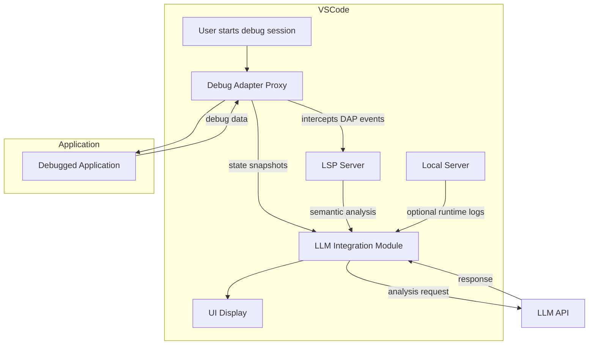

# Комплексное руководство по Zero-Configuration Debugging для AI Debugger Sidecar

## Содержание
1. [Введение](#введение)
2. [Архитектура системы](#архитектура-системы)
3. [Установка и настройка](#установка-и-настройка)
4. [Быстрый старт](#быстрый-старт)
5. [Использование](#использование)
6. [Команды расширения](#команды-расширения)
7. [Формат логов](#формат-логов)
8. [Тестирование и оптимизация](#тестирование-и-оптимизация)
9. [Устранение неполадок](#устранение-неполадок)
10. [Разработка](#разработка)
11. [Глоссарий](#глоссарий)
12. [Архитектурный анализ](#архитектурный-анализ)

## Введение

### Что такое Hypothesis-Driven Debugging?

Hypothesis-Driven Debugging (HDD) — это систематический подход к отладке, который комбинирует научный метод с инструментами искусственного интеллекта. Вместо традиционного "прочёсывания" кода или добавления случайных `console.log`, вы формулируете конкретные гипотезы о возможных причинах проблемы, а затем инструменты автоматически проверяют эти гипотезы, собирая данные во время выполнения приложения и предоставляя структурированные результаты для анализа.

Данная система реализуется в виде VSCode расширения **Debug Sidecar**, которое работает совместно с **Roo Code** (AI‑ассистентом) и предоставляет панель управления для визуализации собранных данных.

### Как это работает (краткое описание)

Процесс отладки разбит на пять последовательных фаз:

1. **Гипотезы** – вы анализируете проблему и предлагаете 3‑5 пронумерованных предположений (H1, H2, … H5) о том, что может быть причиной ошибки.
2. **Инструментирование** – в код внедряются специальные маркеры, которые отправляют отладочные данные на локальный сервер. Каждая гипотеза идентифицируется своим номером, что позволяет различать логи.
3. **Наблюдение** – вы запускаете приложение и выполняете действия, которые воспроизводят проблему. Расширение собирает данные в реальном времени и отображает их в панели «AI Debugger».
4. **Анализ** – после завершения сценария вы запрашиваете анализ собранных логов. Roo Code сопоставляет данные с каждой гипотезой и предлагает наиболее вероятную причину проблемы.
5. **Очистка** – все добавленные отладочные блоки автоматически удаляются из кода с помощью встроенной команды очистки.

### Преимущества подхода

- **Структурированность** – отладка превращается в последовательный исследовательский процесс, а не в хаотичный поиск.
- **Автоматизация** – сбор данных, их агрегация и очистка кода выполняются автоматически.
- **Визуализация** – WebView Dashboard наглядно показывает, какие гипотезы порождают какие данные, с цветовым кодированием.
- **Интеграция с AI** – Roo Code использует собранные логи для формирования точных ответов, основанных на реальных данных выполнения.
- **Безопасность** – всё работает локально, данные не покидают ваш компьютер.
- **Zero-Configuration UX** – нулевая настройка, всё работает из коробки.

## Архитектура системы

Система состоит из четырёх основных компонентов:

1. **VSCode расширение «Debug Sidecar»**
   – запускает локальный HTTP-сервер на случайном свободном порту для приёма отладочных данных
   – сохраняет номер порта в файл `.debug_port` в корне рабочей области
   – создаёт файл `.ai_debug_config` с URL сервера и статусом
   – сохраняет логи в файл `.ai_debug_logs.json` для персистентного хранения
   – предоставляет команды для управления сервером и очистки кода
   – отображает логи в канале вывода «AI Debugger»
   – автоматически регистрирует MCP-сервер RooTrace в конфигурации `.roo/mcp.json`

2. **MCP-сервер RooTrace (stdio)**
   – работает через stdio (стандартный ввод/вывод) для интеграции с AI-ассистентами
   – предоставляет 4 MCP-инструмента для взаимодействия с отладочной системой:
     - `read_runtime_logs` - получение логов отладочной сессии
     - `get_debug_status` - статус сервера, список активных гипотез и текущей сессии
     - `clear_session` - очистка сессии отладки, сброс гипотез и логов
     - `inject_probes` - инъекция проб в код для дополнительной отладочной информации
   – автоматически детектирует установленное расширение (Roo Code или Roo Cline)
   – создаёт соответствующую конфигурацию в `.roo/mcp.json`
   – Zero-Config через авто-регистрацию MCP-сервера

3. **WebView Dashboard**
   – встроенная панель VSCode, которая показывает логи в реальном времени
   – цветовое кодирование по гипотезам (H1 – красный, H2 – зелёный, H3 – синий, H4 – жёлтый, H5 – пурпурный)
   – отображает логи в обратном хронологическом порядке (новые сверху)
   – кнопка очистки логов

4. **Roo Code / Roo Cline**
   – AI-ассистенты для VSCode, которые интегрируются с MCP-сервером RooTrace
   – используют MCP-инструменты для управления отладочными сессиями
   – при инструментировании кода добавляют блоки `// AI_DEBUG_START … // AI_DEBUG_END` с `fetch`‑запросами на локальный HTTP-сервер
   – после выполнения сценария анализируют логи и делают выводы

### Поток данных

```mermaid
flowchart TD
    A[Пользователь ставит задачу отладки] --> B[Roo Code формирует гипотезы H1..H5]
    B --> C[Roo Code внедряет отладочные блоки в код]
    C --> D[Пользователь запускает приложение]
    D --> E[Код отправляет данные на localhost:порт]
    E --> F[Debug Sidecar сервер принимает данные]
    F --> G[Логи выводятся в канал AI Debugger]
    F --> H[Логи передаются в WebView Dashboard]
    G --> I[Пользователь даёт команду "Analyze logs"]
    H --> I
    I --> J[Roo Code анализирует логи и предлагает выводы]
    J --> K[Пользователь подтверждает правильную гипотезу]
    K --> L[Команда Cleanup удаляет отладочные блоки]
```

### Формат файлов конфигурации

- **`.debug_port`** – простой текстовый файл с номером порта, который слушает HTTP-сервер (например, `51234`). Создаётся автоматически при запуске сервера, удаляется при остановке.
- **`.ai_debug_config`** – JSON‑файл, который содержит настройки отладки (URL сервера, статус, timestamp). Пример:
  ```json
  {
    "url": "http://localhost:51234/",
    "status": "active",
    "timestamp": 1737200000000
  }
  ```
  Файл используется для интеграции с Roo Code и создается/удаляется автоматически.

- **`.ai_debug_logs.json`** – JSON‑файл для персистентного хранения логов отладки. Создаётся автоматически при первом логе, содержит массив записей логов с полями `timestamp`, `hypothesisId`, `context`, `data`. Файл очищается командой очистки.

- **`.roo/mcp.json`** – конфигурационный файл MCP, создаваемый автоматически в корне рабочей области. Формат зависит от установленного расширения:

  **Для Roo Code:**
  ```json
  {
    "servers": [
      {
        "name": "roo-trace",
        "description": "RooTrace MCP Server for debugging and tracing",
        "handler": {
          "type": "stdio",
          "command": "node",
          "args": ["/путь/к/расширению/out/mcp-server.js"]
        },
        "tools": [...]
      }
    ]
  }
  ```

  **Для Roo Cline:**
  ```json
  {
    "mcpServers": {
      "roo-trace": {
        "command": "node",
        "args": ["/путь/к/расширению/out/mcp-server.js"],
        "alwaysAllow": ["read_runtime_logs", "get_debug_status", "clear_session", "inject_probes"]
      }
    }
  }
  ```
## MCP-Интеграция

### Обзор

Система интегрирована с Model Context Protocol (MCP) через два компонента:

1. **HTTP-сервер** (в [`extension.ts`](../src/extension.ts)) – принимает отладочные данные через POST-запросы и сохраняет их в память и файл
2. **MCP-сервер RooTrace** (в [`mcp-server.ts`](../src/mcp-server.ts)) – работает через stdio и предоставляет инструменты для AI-ассистентов

MCP-сервер автоматически детектирует установленное расширение (Roo Code или Roo Cline) и создаёт соответствующую конфигурацию.

### Архитектура MCP

```
┌─────────────────────────────────────────────────────────────────┐
│              Roo Code / Roo Cline (AI Assistant)              │
│  ┌───────────────────────────────────────────────────────────┐  │
│  │         MCP Client Interface                             │  │
│  │  - Invokes MCP tools via stdio                          │  │
│  │  - Processes tool responses                              │  │
│  │  - Integrates with debugging workflow                    │  │
│  └───────────────────────────────────────────────────────────┘  │
└─────────────────────────────────────────────────────────────────┘
                                   │ (stdio)
                                   ▼
┌─────────────────────────────────────────────────────────────────┐
│              RooTrace MCP Server (mcp-server.js)              │
│  ┌───────────────────────────────────────────────────────────┐  │
│  │         MCP Handler (mcp-handler.ts)                    │  │
│  │  - read_runtime_logs                                     │  │
│  │  - get_debug_status                                     │  │
│  │  - clear_session                                        │  │
│  │  - inject_probes                                        │  │
│  └───────────────────────────────────────────────────────────┘  │
│                              │                                   │
│  ┌───────────────────────────────────────────────────────────┐  │
│  │         DebugSession (in-memory storage)                  │  │
│  │  - Hypotheses: H1, H2, H3 (pre-configured)         │  │
│  │  - Logs: up to 1000 entries                           │  │
│  └───────────────────────────────────────────────────────────┘  │
└─────────────────────────────────────────────────────────────────┘
                                   │
                                   ▼
┌─────────────────────────────────────────────────────────────────┐
│              Debug Sidecar Extension (extension.ts)              │
│  ┌───────────────────────────────────────────────────────────┐  │
│  │         HTTP Server (localhost:random_port)              │  │
│  │  - Accepts POST / with debug data                       │  │
│  │  - GET /logs returns in-memory logs                     │  │
│  │  - CORS headers enabled                                 │  │
│  └───────────────────────────────────────────────────────────┘  │
│                              │                                   │
│  ┌───────────────────────────────────────────────────────────┐  │
│  │         Log Storage                                       │  │
│  │  - In-memory: string[]                                 │  │
│  │  - Persistent: .ai_debug_logs.json                     │  │
│  │  - Output Channel: "AI Debugger"                        │  │
│  │  - WebView Dashboard                                     │  │
│  └───────────────────────────────────────────────────────────┘  │
└─────────────────────────────────────────────────────────────────┘
```

### MCP-инструменты

#### 1. `read_runtime_logs`
- **Назначение**: Получает логи отладочной сессии RooTrace
- **Параметры**:
  - `sessionId` (опционально): ID сессии для получения логов (если не указан, возвращаются логи текущей сессии)
- **Пример вызова**:
```json
{
  "name": "read_runtime_logs",
  "arguments": {
    "sessionId": "session-123"
  }
}
```

#### 2. `get_debug_status`
- **Назначение**: Возвращает статус сервера (активен/не активен), список активных гипотез и текущую сессию
- **Параметры**: Нет
- **Пример вызова**:
```json
{
  "name": "get_debug_status",
  "arguments": {}
}
```

#### 3. `clear_session`
- **Назначение**: Очищает сессию отладки RooTrace, сбрасывает все гипотезы и логи
- **Параметры**:
  - `sessionId` (опционально): ID сессии для очистки (если не указан, очищается текущая сессия)
- **Пример вызова**:
```json
{
  "name": "clear_session",
  "arguments": {
    "sessionId": "session-123"
  }
}
```

#### 4. `inject_probes`
- **Назначение**: Инъекция проб в код для дополнительной отладочной информации
- **Параметры**:
  - `filePath`: Путь к файлу для инъекции проб
  - `lineNumber`: Номер строки для инъекции пробы
  - `probeType`: Тип пробы ('log', 'trace', 'error')
  - `message`: Сообщение для пробы
- **Пример вызова**:
```json
{
  "name": "inject_probes",
  "arguments": {
    "filePath": "./src/main.js",
    "lineNumber": 42,
    "probeType": "log",
    "message": "Checking variable value"
  }
}
```

### Zero-Configuration UX

MCP-интеграция обеспечивает Zero-Configuration UX через автоматическую регистрацию сервера RooTrace:

1. При активации расширения Debug Sidecar происходит автоматическая детекция установленного расширения (Roo Code или Roo Cline)
2. Автоматически создаётся конфигурация в `.roo/mcp.json` в корне рабочей области
3. MCP-сервер регистрируется в системе и становится доступным для AI-ассистента
4. Все инструменты становятся доступны без дополнительной настройки
5. Роутинг вызовов инструментов происходит через stdio (стандартный ввод/вывод)

## Установка и настройка


### Требования

- **Node.js** версии 16 или выше
- **VSCode** версии 1.74 или выше
- **Roo Code** расширение (установлено из Marketplace)
- **Git** (опционально, для клонирования репозитория)

### Установка расширения Debug Sidecar

Расширение пока не опубликовано в Marketplace, поэтому его нужно собрать и запустить в режиме разработки:

1. Клонируйте репозиторий (или скопируйте папку `debug-sidecar` в вашу рабочую область):
   ```bash
   git clone <repository-url>
   cd debug-sidecar
   ```

2. Установите зависимости:
   ```bash
   npm install
   ```

3. Скомпилируйте TypeScript‑код:
   ```bash
   npm run compile
   ```

4. Запустите расширение в хосте разработки VSCode:
   - Откройте папку `debug-sidecar` в VSCode
   - Нажмите `F5` (или выберите **Run → Start Debugging**)
   - Откроется новое окно VSCode с установленным расширением «Debug Sidecar»

### Настройка Roo Code с System Prompt

1. Убедитесь, что расширение Roo Code установлено и активно.

2. Скопируйте файл `prompts/roo-code-system-prompt.md` в папку, доступную Roo Code (например, в корень рабочей области или в специальную директорию промптов).

3. В настройках Roo Code укажите путь к этому промпту как системный промпт для режима отладки (способ зависит от версии Roo Code; обычно это делается через конфигурационный файл `.roo` или через UI).

   Альтернативно, вы можете просто открыть файл промпта и скопировать его содержимое в системный промпт Roo Code вручную.

4. Проверьте, что Roo Code знает о протоколе Hypothesis‑Driven Debugging – при постановке задачи отладки он должен предлагать сформулировать гипотезы и инструментировать код.

## Быстрый старт

Здесь представлена пошаговая инструкция для первого запуска системы на простом примере.

### Пример: отладка функции сложения

Допустим, у вас есть файл `sum.js` со следующей функцией:

```javascript
function add(a, b) {
    return a + b;
}

console.log(add(2, 3)); // ожидаем 5, но получаем 6
```

Вы подозреваете, что проблема может быть в:
- **H1** – переменная `a` передаётся неверно
- **H2** – переменная `b` передаётся неверно
- **H3** – оператор `+` выполняет конкатенацию вместо сложения

### Шаги

1. **Запустите сервер отладки**  
   В VSCode с установленным Debug Sidecar откройте палитру команд (`Ctrl+Shift+P` / `Cmd+Shift+P`) и выполните команду **Start Debug Sidecar Server**. В канале «AI Debugger» появится сообщение о том, что сервер запущен на порту (например, `51234`).

2. **Откройте Dashboard**  
   Выполните команду **Open AI Debugger Dashboard**. Справа откроется панель с заголовком «AI Debugger Dashboard». Пока она пуста – логов ещё нет.

3. **Попросите Roo Code проинструментировать код**  
   Откройте файл `sum.js`, выделите функцию `add` и вызовите Roo Code (обычно `Cmd+I`). Скажите:
   > «Проанализируй эту функцию. Предложи гипотезы, почему `add(2, 3)` возвращает 6 вместо 5, и добавь отладочные блоки для проверки каждой гипотезы.»

   Roo Code должен:
   - Сформулировать гипотезы H1, H2, H3
   - Вставить в код блоки вида:

   ```javascript
   // AI_DEBUG_START
   try {
     fetch('http://localhost:51234/', {
       method: 'POST',
       headers: { 'Content-Type': 'application/json' },
       body: JSON.stringify({
         hypothesisId: 'H1',
         message: 'Проверка значения a',
         state: { a, b, result: a + b }
       })
     });
   } catch(e) {}
   // AI_DEBUG_END
   ```

   (и аналогично для H2 и H3)

4. **Запустите код**  
   Выполните файл в терминале:
   ```bash
   node sum.js
   ```

5. **Наблюдайте за логами**  
   В Dashboard появятся три записи с цветными полосками слева (красная для H1, зелёная для H2, синяя для H3). В каждой записи вы увидите значения переменных `a`, `b` и `result`.

6. **Проанализируйте результаты**  
   Дайте команду Roo Code: «Analyze logs». Roo Code прочитает логи из канала «AI Debugger» и скажет, какая гипотеза подтвердилась (например, «H3: оператор + выполняет конкатенацию, потому что один из аргументов – строка»).

7. **Очистите код**  
   После анализа выполните команду **Cleanup AI Debug Code**. Все блоки между `// AI_DEBUG_START` и `// AI_DEBUG_END` будут удалены из файла `sum.js`, а файл `.ai_debug_config` (если он был создан) – удалён.

## Использование

### Запуск сервера отладки

Сервер запускается автоматически при активации расширения (событие `onStartupFinished`). Однако вы можете управлять им вручную с помощью команд:

- **Start Debug Sidecar Server** – запускает HTTP‑сервер на случайном свободном порту.
- **Stop Debug Sidecar Server** – останавливает сервер и удаляет файл `.debug_port`.

Порт сервера сохраняется в файл `.debug_port` в корне рабочей области. Этот файл используется Roo Code для определения адреса, на который нужно отправлять данные.

### Открытие WebView Dashboard

Команда **Open AI Debugger Dashboard** создаёт (или показывает, если уже создана) WebView‑панель во второй колонке редактора. Панель отображает логи в реальном времени, группируя их по гипотезам.

**Элементы Dashboard:**
- Заголовок с кнопкой **Clear Logs** (очищает только отображение, не затрагивая хранилище расширения)
- Список записей, каждая из которых соответствует одному POST‑запросу
- Цветная полоска слева указывает на гипотезу (H1–H5)
- Внутри записи:
  - Тег гипотезы (например, `H1`) с соответствующим цветом фона
  - Временная метка
  - Контекстное сообщение (`message`)
  - Данные (`state`) в формате JSON

### Работа с Roo Code (постановка задачи, гипотезы, инъекция)

1. **Постановка задачи**  
   Опишите Roo Code проблему, которую нужно исследовать. Укажите, что вы хотите использовать Hypothesis‑Driven Debugging.

2. **Формулировка гипотез**  
   Roo Code предложит 3–5 гипотез, пронумерованных H1…H5. Каждая гипотеза должна быть конкретной и проверяемой.

3. **Инъекция отладочного кода**  
   Roo Code модифицирует ваш код, добавляя блоки `// AI_DEBUG_START … // AI_DEBUG_END`. Внутри блока находится `fetch`‑запрос на адрес `http://localhost:<порт>/` с JSON‑телом, содержащим:
   - `hypothesisId` – идентификатор гипотезы (`"H1"`, `"H2"`, …)
   - `message` – текстовое описание контекста
   - `state` – объект с текущими значениями переменных (или любыми другими данными)

   **Важно:** Roo Code должен обернуть `fetch` в `try…catch`, чтобы ошибка сети не сломала приложение.

4. **Запуск приложения и сбор данных**  
   Выполните приложение как обычно. Каждый раз, когда выполняется отладочный блок, данные отправляются на сервер и появляются в Dashboard.

### Анализ логов

После того как вы воспроизвели проблему и собрали достаточное количество логов, дайте Roo Code команду **Analyze logs** (или скажите «Проанализируй логи из AI Debugger»). Roo Code:

- Прочитает содержимое канала вывода «AI Debugger»
- Сопоставит каждую запись с соответствующей гипотезой
- Определит, какие гипотезы подтверждаются данными, а какие опровергаются
- Предложит наиболее вероятную причину проблемы и, возможно, варианты исправления

### Очистка кода

Когда анализ завершён и проблема найдена, выполните команду **Cleanup AI Debug Code**. Она:

1. Находит во всех файлах рабочей области (за исключением `node_modules`) блоки между `// AI_DEBUG_START` и `// AI_DEBUG_END`
2. Сохраняет все файлы перед очисткой для предотвращения потери несохранённых изменений
3. Удаляет эти блоки, оставляя остальной код неизменным
4. Удаляет файл `.ai_debug_config`, если он существует
5. Удаляет файл `.ai_debug_logs.json`, если он существует
6. Показывает уведомление о количестве изменённых файлов и удалённых маркеров

**Внимание:** очистка затрагивает только файлы с расширениями `.ts`, `.js`, `.tsx`, `.jsx`. Убедитесь, что все нужные файлы находятся в корневой папке проекта.

## Команды расширения

Все команды доступны через палитру команд VSCode (`Ctrl+Shift+P` / `Cmd+Shift+P`).

| Команда | Идентификатор | Описание |
|---------|---------------|----------|
| Start Debug Sidecar Server | `rooTrace.startServer` | Запускает локальный HTTP‑сервер для приёма отладочных данных. Если сервер уже запущен, показывает соответствующее сообщение. |
| Stop Debug Sidecar Server | `rooTrace.stopServer` | Останавливает сервер и удаляет файлы `.debug_port` и `.ai_debug_config`. |
| Clear AI Debugger Logs | `rooTrace.clearLogs` | Очищает канал вывода «AI Debugger», внутреннее хранилище логов и файл `.ai_debug_logs.json`. |
| Open AI Debugger Dashboard | `ai-debugger.openDashboard` | Открывает WebView‑панель с визуализацией логов в реальном времени. |
| Cleanup AI Debug Code | `ai-debugger.cleanup` | Удаляет все блоки кода, помеченные `// AI_DEBUG_START … // AI_DEBUG_END`, из файлов проекта. Также удаляет файлы `.ai_debug_config` и `.ai_debug_logs.json`. |

**Горячие клавиши** по умолчанию не назначены. Вы можете назначить их в настройках VSCode (File → Preferences → Keyboard Shortcuts), используя идентификаторы команд из таблицы выше.

## Формат логов

### Структура лога

Каждая запись в канале «AI Debugger» имеет следующий формат:

```
[LOG][Hypothesis: H1][Time: 14:35:22]
Context: "Проверка значения a"
Data: {
  "a": 2,
  "b": 3,
  "result": 5
}
---
```

- **`[LOG]`** – префикс, указывающий, что это запись отладки.
- **`[Hypothesis: H1]`** – идентификатор гипотезы (H1…H5).
- **`[Time: HH:MM:SS]`** – время получения запроса (часы, минуты, секунды).
- **`Context`** – строка, переданная в поле `message`.
- **`Data`** – объект `state`, отформатированный как JSON с отступами.
- **`---`** – разделитель между записями.

### Примеры логов

```text
[LOG][Hypothesis: H1][Time: 14:35:22]
Context: "Проверка значения a"
Data: {
  "a": 2,
  "b": 3,
  "result": 5
}
---
[LOG][Hypothesis: H2][Time: 14:35:23]
Context: "Проверка значения b"
Data: {
  "a": 2,
  "b": "3",
  "result": "23"
}
---
[LOG][Hypothesis: H3][Time: 14:35:24]
Context: "Проверка операции +"
Data: {
  "typeOfA": "number",
  "typeOfB": "string",
  "result": "23"
}
---
```

### Цветовая индикация гипотез

В WebView Dashboard каждая гипотеза имеет свой цвет для быстрой визуальной идентификации:

| Гипотеза | Цвет границы | Цвет фона тега |
|----------|--------------|----------------|
| H1       | #ff4d4d (красный) | rgba(255, 77, 77, 0.2) |
| H2       | #4dff4d (зелёный) | rgba(77, 255, 77, 0.2) |
| H3       | #4d4dff (синий)  | rgba(77, 77, 255, 0.2) |
| H4       | #ffff4d (жёлтый) | rgba(255, 255, 77, 0.2) |
| H5       | #ff4dff (пурпурный) | rgba(255, 77, 255, 0.2) |

Цвета соответствуют переменным CSS, определённым в `webview/styles.css`, и автоматически подстраиваются под тему VSCode.

## Тестирование и оптимизация

### ✅ Что было реализовано:

1. **CORS поддержка** - Сервер теперь отправляет заголовки `Access-Control-Allow-Origin: *` для поддержки браузерных приложений
2. **Preflight запросы** - Обработка OPTIONS запросов для CORS
3. **Улучшенная очистка** - Сохранение документов перед очисткой для предотвращения проблем с несохраненными файлами
4. **Безопасный рантайм** - Использование `try-catch` вокруг `fetch` вызовов
5. **Rate limiting** - Защита от перегрузки сервера
6. **Буферизация логов** - Оптимизация для высокочастотных сценариев

### Тестирование CORS поддержки

#### Тест 1: Браузерное приложение
```javascript
// Тестируем в браузере (Chrome/Firefox)
fetch('http://localhost:PORT/', {
  method: 'POST',
  headers: {
    'Content-Type': 'application/json',
  },
  body: JSON.stringify({
    hypothesisId: 'H1',
    message: 'Browser test',
    state: { browser: 'chrome', version: 'latest' }
  })
})
.then(response => response.json())
.then(data => console.log('Success:', data))
.catch(error => console.error('Error:', error));
```

#### Тест 2: Node.js приложение
```javascript
// Тестируем в Node.js
const http = require('http');

const postData = JSON.stringify({
  hypothesisId: 'H2',
  message: 'Node.js test',
  state: { runtime: 'node', version: '18.x' }
});

const options = {
  hostname: 'localhost',
  port: PORT,
  path: '/',
  method: 'POST',
  headers: {
    'Content-Type': 'application/json',
    'Content-Length': postData.length
  }
};

const req = http.request(options, (res) => {
  res.on('data', (chunk) => {
    console.log('Response:', chunk.toString());
  });
});

req.write(postData);
req.end();
```

### Тестирование Race Conditions

#### Тест 3: Высокая частота запросов
```javascript
// Тестируем 1000 запросов в секунду
for (let i = 0; i < 1000; i++) {
  setTimeout(() => {
    fetch('http://localhost:PORT/', {
      method: 'POST',
      headers: { 'Content-Type': 'application/json' },
      body: JSON.stringify({
        hypothesisId: 'H3',
        message: `High frequency test ${i}`,
        state: { index: i, timestamp: Date.now() }
      })
    }).catch(console.error);
  }, i * 1); // 1ms интервал
}
```

#### Тест 4: Параллельные запросы
```javascript
// Тестируем 50 параллельных запросов
const promises = Array.from({ length: 50 }, (_, i) =>
  fetch('http://localhost:PORT/', {
    method: 'POST',
    headers: { 'Content-Type': 'application/json' },
    body: JSON.stringify({
      hypothesisId: `H${(i % 5) + 1}`,
      message: `Parallel request ${i}`,
      state: { parallel: true, id: i }
    })
  }).catch(console.error)
);

Promise.all(promises).then(() => {
  console.log('All parallel requests completed');
});
```

### Тестирование функции очистки

#### Тест 5: Очистка несохраненных файлов
1. Откройте файл с отладочным кодом
2. Убедитесь, что файл не сохранен
3. Вызовите команду `ai-debugger.cleanup`
4. Проверьте, что файлы сохраняются перед очисткой

#### Тест 6: Очистка с Undo поддержкой
1. Добавьте несколько отладочных блоков
2. Выполните очистку
3. Используйте Ctrl+Z (Cmd+Z) для отмены
4. Проверьте, что отмена работает корректно

### Оптимизация производительности

#### Улучшение 1: Буферизация логов
```typescript
// Добавлена буферизация для высокочастотных сценариев
interface LogBuffer {
  entries: LogEntry[];
  flushTimer: NodeJS.Timeout | null;
}

private logBuffer: LogBuffer = {
  entries: [],
  flushTimer: null
};

private bufferLogEntry(logEntry: LogEntry) {
  this.logBuffer.entries.push(logEntry);
  
  if (!this.logBuffer.flushTimer) {
    this.logBuffer.flushTimer = setTimeout(() => {
      this.flushLogs();
    }, 100); // Flush every 100ms
  }
}
```

#### Улучшение 2: Ограничение скорости
```typescript
// Rate limiting для предотвращения перегрузки
private rateLimiter = new Map<string, { count: number; timestamp: number }>();

private isRateLimited(hypothesisId: string): boolean {
  const now = Date.now();
  const windowMs = 1000; // 1 second window
  const maxRequests = 100; // Max 100 requests per window
  
  const key = `${hypothesisId}_${Math.floor(now / windowMs)}`;
  const current = this.rateLimiter.get(key) || { count: 0, timestamp: now };
  
  if (current.count >= maxRequests) {
    return true;
  }
  
  current.count++;
  this.rateLimiter.set(key, current);
  
  // Cleanup old entries
  setTimeout(() => {
    this.rateLimiter.delete(key);
  }, windowMs * 2);
  
  return false;
}
```

### Рекомендации для использования

#### Для фронтенд разработки:
- CORS заголовки позволяют использовать отладку в браузере
- Preflight запросы обрабатываются корректно
- Безопасный режим: ошибки сервера не ломают приложение

#### Для бэкенд разработки:
- Поддержка высокочастотных запросов
- Буферизация для производительности
- Rate limiting для защиты от перегрузки

#### Для пользователей с ADHD:
- Автоматическая очистка не требует ручного сохранения
- Система "прибирает за собой" - удаляет конфиги и маркеры
- Нулевая когнитивная нагрузка на настройку

### Сценарии тестирования

#### Сценарий 1: Простая отладка
1. Открыть проект в VSCode
2. Сервер запускается автоматически
3. Вызвать Roo Code с ролью "AI Debugger Pro"
4. Добавить отладочные блоки
5. Запустить приложение
6. Наблюдать логи в Dashboard
7. Выполнить очистку

#### Сценарий 2: Браузерная отладка
1. Создать HTML страницу с JavaScript
2. Добавить fetch вызовы к серверу отладки
3. Открыть страницу в браузере
4. Проверить, что CORS не блокирует запросы
5. Наблюдать логи в Dashboard

#### Сценарий 3: Высокая нагрузка
1. Запустить приложение с частыми отладочными вызовами
2. Проверить производительность Dashboard
3. Убедиться, что система не падает
4. Проверить ограничение скорости

### Проверка безопасности

#### Проверка 1: XSS защита
- Входные данные правильно экранируются
- JSON безопасно парсится
- Нет ввода от пользователя в HTML

#### Проверка 2: DOS защита
- Rate limiting предотвращает перегрузку
- Ограничение размера тела запроса
- Валидация входных данных

#### Проверка 3: Очистка безопасности
- Удаление только отладочных маркеров
- Сохранение остального кода без изменений
- Проверка на наличие маркеров перед удалением

## Устранение неполадок

### Частые проблемы и решения

| Проблема | Возможная причина | Решение |
|----------|-------------------|---------|
| Сервер не запускается | Порт уже занят другим приложением | Расширение автоматически выбирает свободный порт. Если это не удаётся, перезапустите VSCode или проверьте, нет ли других локальных серверов. |
| Логи не появляются в Dashboard | WebView не получил сообщение от расширения | Убедитесь, что Dashboard открыт (команда **Open AI Debugger Dashboard**). Проверьте, нет ли ошибок в консоли разработчика WebView (щелкок правой кнопкой внутри панели → **Inspect**). |
| Roo Code не отправляет запросы | Файл `.debug_port` отсутствует или содержит неверный порт | Запустите сервер вручную (**Start Debug Sidecar Server**), затем проверьте, что файл `.debug_port` создан в корне рабочей области и содержит число. |
| Очистка не удаляет блоки | Регулярное выражение не находит маркеры | Убедитесь, что блоки имеют точный формат `// AI_DEBUG_START` и `// AI_DEBUG_END` (без лишних пробелов, в отдельных строках). |
| Dashboard показывает старые логи | Логи сохраняются в памяти расширения | Используйте команду **Clear AI Debugger Logs** для очистки внутреннего хранилища. |
| Ошибка "Invalid JSON" в канале AI Debugger | Запрос отправлен с некорректным JSON | Проверьте, что `fetch` передаёт валидный JSON и заголовок `Content-Type: application/json`. |

### Как проверить работу сервера

1. Узнайте порт сервера – посмотрите в канале «AI Debugger» сообщение вида `Debug sidecar server started on port 51234` или откройте файл `.debug_port`.

2. Отправьте тестовый запрос с помощью `curl`:
   ```bash
   curl -X POST http://localhost:51234/ \
     -H "Content-Type: application/json" \
     -d '{"hypothesisId": "H1", "message": "Тест", "state": {"test": true}}'
   ```
   В ответе должен быть `{"status":"success","message":"Data received"}`.

3. Проверьте, появилась ли запись в канале «AI Debugger» и в Dashboard.

### Что делать, если логи не появляются

1. **Убедитесь, что сервер запущен** – выполните команду **Start Debug Sidecar Server**.
2. **Проверьте порт** – убедитесь, что `fetch`‑запросы отправляются на тот же порт, что указан в `.debug_port`.
3. **Проверьте CORS** – сервер теперь устанавливает заголовки CORS `Access-Control-Allow-Origin: *`, что позволяет использовать его из браузера.
4. **Проверьте консоль браузера** – если отладочные запросы идут из браузера, откройте DevTools и посмотрите, нет ли ошибок сети.
5. **Включите подробное логирование** – в коде расширения можно временно добавить `console.log` в функцию `logToOutputChannel`, чтобы убедиться, что данные доходят.

## Разработка

### Структура проекта

```
debug-sidecar/
├── src/
│   └── extension.ts          # Основной код расширения
├── webview/
│   ├── styles.css           # Стили Dashboard
│   └── (HTML генерируется динамически в extension.ts)
├── package.json             # Манифест расширения
├── tsconfig.json            # Конфигурация TypeScript
└── .vscode/
    └── launch.json          # Конфигурация для запуска в режиме разработки
```

### Как внести изменения

1. **Изменение логики сервера**  
   Отредактируйте функции `startServer`, `stopServer`, `savePortToFile` и `removePortFile` в `src/extension.ts`. Обратите внимание, что сервер использует Node.js модуль `http`.

2. **Изменение формата логов**  
   Функция `formatLogEntry` определяет, как записи форматируются для канала вывода. Функция `logToOutputChannel` отвечает за сохранение в памяти и отправку в WebView.

3. **Изменение WebView Dashboard**  
   HTML‑контент генерируется функцией `getWebviewContent`. Измените её, чтобы добавить новые поля или изменить вёрстку. Стили находятся в `webview/styles.css`.

4. **Добавление новых команд**  
   Добавьте запись в раздел `contributes.commands` файла `package.json`, затем зарегистрируйте команду в `activate` (см. примеры для `openDashboardCommand` и `cleanupCommand`).

5. **Изменение процесса очистки**  
   Функция `cleanupDebugCode` использует регулярное выражение `debugMarkerRegex` для поиска блоков. При необходимости можно изменить regex или добавить дополнительные шаги очистки.

### Сборка расширения

После внесения изменений:

1. Скомпилируйте TypeScript:
   ```bash
   npm run compile
   ```
   (или `npm run watch` для автоматической компиляции при изменении файлов)

2. Запустите расширение в хосте разработки VSCode (F5).

3. Для создания VSIX‑пакета (если планируется публикация в Marketplace) используйте `vsce`:
   ```bash
   npm install -g vsce
   vsce package
   ```

### Отладка расширения

- Установите точку останова в `src/extension.ts` и запустите дебаггер VSCode (F5). Новое окно VSCode будет использовать скомпилированное расширение.
- Для отладки WebView откройте Developer Tools внутри панели Dashboard (правая кнопка внутри панели → **Inspect**).
- Логи расширения выводятся в канал «Debug Console» основного окна VSCode (где запущен дебаггер).

## Глоссарий

- **Hypothesis-Driven Debugging (HDD)** – методология отладки, основанная на проверке заранее сформулированных гипотез.
- **Debug Sidecar** – VSCode расширение, обеспечивающее инфраструктуру для HDD (локальный сервер, Dashboard, очистка).
- **Roo Code** – AI‑ассистент для VSCode, который интегрируется с Debug Sidecar для автоматического инструментирования и анализа.
- **Гипотеза (H1…H5)** – конкретное предположение о причине ошибки, идентифицируемое уникальным номером.
- **AI Debugger** – канал вывода в VSCode, куда попадают все принятые сервером логи.
- **Dashboard** – WebView‑панель для визуализации логов в реальном времени.
- **Маркеры отладки** – комментарии `// AI_DEBUG_START` и `// AI_DEBUG_END`, обрамляющие внедрённый отладочный код.
- **Очистка (Cleanup)** – автоматическое удаление всех блоков между маркерами отладки.
- **Zero-Configuration UX** – пользовательский опыт без настройки, всё работает из коробки.

## Архитектурный анализ

### Вариант 1: VSCode Extension с локальным сервером

#### Архитектурное описание

```
┌─────────────────────────────────────────────────────────────────┐
│                     VSCode Extension                            │
│  ┌───────────────────────────────────────────────────────────┐  │
│  │           Code Injection Module                           │  │
│  │  - AST Parser                                             │  │
│  │  - Log Statement Generator                                │  │
│  │  - Code Modifier (TextEdit API)                           │  │
│  └───────────────────────────────────────────────────────────┘  │
│                              │                                   │
│  ┌───────────────────────────────────────────────────────────┐  │
│  │           Local HTTP/WebSocket Server                    │  │
│  │  - Express.js / Node.js HTTP server                       │  │
│  │  - WebSocket для реального времени                         │  │
│  │  - Data Aggregator                                         │  │
│  │  - LLM Context Builder                                    │  │
│  └───────────────────────────────────────────────────────────┘  │
│                              │                                   │
│  ┌───────────────────────────────────────────────────────────┐  │
│  │           LLM Integration Module                          │  │
│  │  - API Client (OpenAI, Anthropic, etc.)                  │  │
│  │  - Context Management                                     │  │
│  │  - Response Parser                                        │  │
│  └───────────────────────────────────────────────────────────┘  │
└─────────────────────────────────────────────────────────────────┘
                                 │
                                 ▼
┌─────────────────────────────────────────────────────────────────┐
│                    User Application Code                        │
│  ┌───────────────────────────────────────────────────────────┐  │
│  │  Original Code + Injected Logs                            │  │
│  │  - console.log() statements                               │  │
│  │  - fetch() calls to local server                          │  │
│  │  - Custom logger functions                                 │  │
│  └───────────────────────────────────────────────────────────┘  │
└─────────────────────────────────────────────────────────────────┘
```

#### Компоненты

1. **Code Injection Module**
   - Использует AST парсеры для каждого языка (TypeScript/JavaScript: @babel/parser, Python: ast, Java: JavaParser)
   - Генерирует логирующие операторы на основе анализа потока управления
   - Применяет изменения через VSCode TextEdit API

2. **Local Server**
   - HTTP сервер на Node.js (Express.js или Fastify)
   - WebSocket сервер для реального времени (ws или socket.io)
   - Порт выбирается динамически для избежания конфликтов
   - Использует `vscode.env.asExternalUri()` для безопасного доступа
   - **Улучшения**: Добавлены CORS заголовки и preflight обработка

3. **Data Collection**
   - Собирает логи в структурированном формате
   - Включает метаданные: timestamp, file path, line number, function name
   - Агрегирует данные по сессиям отладки
   - **Улучшения**: Rate limiting и буферизация для производительности

4. **LLM Integration**
   - Отправляет собранные данные в LLM API
   - Управляет размером контекста (токены)
   - Форматирует ответы для отображения в VSCode

#### Преимущества

- **Простота реализации**: Использует стандартные VSCode Extension API
- **Гибкость**: Полный контроль над процессом сбора данных
- **Реальное время**: WebSocket позволяет получать данные мгновенно
- **Языковая независимость**: Можно поддерживать любые языки через соответствующие AST парсеры
- **Безопасность**: Локальный сервер работает только на localhost
- **Zero-Configuration**: Автоматическая настройка при запуске

#### Недостатки

- **Модификация кода**: Требует изменения исходного кода пользователя
- **Производительность**: Внедрение логов может замедлить выполнение
- **Очистка**: Нужно удалять внедрённые логи после отладки
- **Конфликты**: Могут возникать конфликты с существующим логированием

#### Требования к безопасности

- Сервер слушает только на 127.0.0.1 (localhost)
- Использует случайный порт для избежания конфликтов
- Валидация всех входящих запросов
- Опциональная аутентификация через токен
- **Улучшения**: CORS защита и rate limiting

### Вариант 2: Интеграция с VSCode Debug Adapter Protocol

#### Архитектурное описание

```
┌─────────────────────────────────────────────────────────────────┐
│                   VSCode Extension                              │
│  ┌───────────────────────────────────────────────────────────┐  │
│  │         Custom Debug Adapter                               │  │
│  │  - Implements Debug Adapter Protocol (DAP)                 │  │
│  │  - Intercepts DAP events                                   │  │
│  │  - Data Collector                                          │  │
│  └───────────────────────────────────────────────────────────┘  │
│                              │                                   │
│  ┌───────────────────────────────────────────────────────────┐  │
│  │         DAP Event Interceptor                            │  │
│  │  - stopped events (breakpoints, exceptions)              │  │
│  │  - variables requests                                    │  │
│  │  - stackTrace requests                                    │  │
│  │  - threads requests                                       │  │
│  └───────────────────────────────────────────────────────────┘  │
│                              │                                   │
│  ┌───────────────────────────────────────────────────────────┐  │
│  │         Data Aggregator & LLM Integration                 │  │
│  │  - State Snapshot Builder                                 │  │
│  │  - Context Formatter                                      │  │
│  │  - LLM API Client                                         │  │
│  └───────────────────────────────────────────────────────────┘  │
└─────────────────────────────────────────────────────────────────┘
                                 │
                                 ▼
┌─────────────────────────────────────────────────────────────────┐
│              Existing Debug Adapter (proxy mode)                │
│  ┌───────────────────────────────────────────────────────────┐  │
│  │  - Node.js Debugger (vscode-js-debug)                     │  │
│  │  - Python Debugger (debugpy)                              │  │
│  │  - Java Debugger (Java Debug Server)                      │  │
│  └───────────────────────────────────────────────────────────┘  │
└─────────────────────────────────────────────────────────────────┘
                                 │
                                 ▼
┌─────────────────────────────────────────────────────────────────┐
│                    Debugged Application                         │
└─────────────────────────────────────────────────────────────────┘
```

#### Компоненты

1. **Custom Debug Adapter**
   - Реализует протокол Debug Adapter Protocol (DAP)
   - Работает в режиме прокси между VSCode и существующими адаптерами
   - Перехватывает все события DAP

2. **Event Interceptor**
   - Перехватывает события `stopped` (breakpoints, exceptions, pause)
   - Собирает данные из запросов `threads`, `stackTrace`, `scopes`, `variables`
   - Записывает изменения переменных через `setVariable`

3. **State Snapshot Builder**
   - Создает снимки состояния приложения в точках остановки
   - Включает: стек вызовов, значения переменных, контекст выполнения
   - Сохраняет историю изменений для анализа трендов

4. **LLM Integration**
   - Формирует контекст из снимков состояния
   - Отправляет запросы на анализ причин проблем
   - Отображает предложения по исправлению

#### Поток данных

```
1. User sets breakpoint
   ↓
2. VSCode → Debug Adapter: setBreakpoints
   ↓
3. Debug Adapter → Existing Debugger: setBreakpoints (proxy)
   ↓
4. Application hits breakpoint
   ↓
5. Existing Debugger → Debug Adapter: stopped event
   ↓
6. Debug Adapter intercepts and collects data:
   - threads → stackTrace → scopes → variables
   ↓
7. Data sent to LLM for analysis
   ↓
8. LLM response displayed in VSCode
```

#### Преимущества

- **Без модификации кода**: Не нужно менять исходный код
- **Стандартный протокол**: Использует официальный протокол VSCode
- **Глубокая интеграция**: Полный доступ к состоянию отладки
- **Мультиязычность**: Работает с любыми языками через существующие адаптеры
- **Точность**: Данные отладки точны и структурированы

#### Недостатки

- **Сложность реализации**: Требует глубокого понимания DAP
- **Зависимость от адаптеров**: Нужен существующий debug adapter для каждого языка
- **Ограничения**: Только данные, доступные через DAP
- **Производительность**: Перехват всех событий может влиять на скорость

#### DAP события для перехвата

| Событие/Запрос | Описание | Использование |
|----------------|----------|---------------|
| `stopped` | Остановка выполнения | Триггер сбора данных |
| `threads` | Список потоков | Контекст выполнения |
| `stackTrace` | Стек вызовов | Поток управления |
| `scopes` | Области видимости | Контекст переменных |
| `variables` | Переменные | Значения данных |
| `setVariable` | Изменение переменных | Отслеживание изменений |
| `breakpoint` | Изменения точек останова | Контроль точек останова |

### Вариант 3: Language Server Protocol (LSP) расширение

#### Архитектурное описание

```
┌─────────────────────────────────────────────────────────────────┐
│                   VSCode Extension                              │
│  ┌───────────────────────────────────────────────────────────┐  │
│  │         LSP Client Extension                              │  │
│  │  - Registers LSP server                                   │  │
│  │  - Manages communication with LSP server                  │  │
│  │  - Displays LLM analysis results                          │  │
│  └───────────────────────────────────────────────────────────┘  │
└─────────────────────────────────────────────────────────────────┘
                                 │
                                 ▼
┌─────────────────────────────────────────────────────────────────┐
│                   Custom LSP Server                            │
│  ┌───────────────────────────────────────────────────────────┐  │
│  │         Semantic Analysis Module                         │  │
│  │  - AST Parser                                             │  │
│  │  - Control Flow Analysis                                  │  │
│  │  - Data Flow Analysis                                     │  │
│  └───────────────────────────────────────────────────────────┘  │
│                              │                                   │
│  ┌───────────────────────────────────────────────────────────┐  │
│  │         Code Action Provider                             │  │
│  │  - textDocument/codeAction                                │  │
│  │  - Generates "Add Debug Log" actions                     │  │
│  │  - Smart log placement suggestions                        │  │
│  └───────────────────────────────────────────────────────────┘  │
│                              │                                   │
│  ┌───────────────────────────────────────────────────────────┐  │
│  │         Diagnostic Provider                              │  │
│  │  - textDocument/diagnostic                               │  │
│  │  - Detects potential issues                              │  │
│  │  - Suggests debug points                                  │  │
│  └───────────────────────────────────────────────────────────┘  │
│                              │                                   │
│  ┌───────────────────────────────────────────────────────────┐  │
│  │         LLM Integration Module                           │  │
│  │  - Context Builder                                        │  │
│  │  - Analysis Request Handler                              │  │
│  │  - Response Formatter                                    │  │
│  └───────────────────────────────────────────────────────────┘  │
└─────────────────────────────────────────────────────────────────┘
```

#### Компоненты

1. **LSP Server**
   - Реализует Language Server Protocol
   - Предоставляет семантический анализ кода
   - Работает как отдельный процесс (Node.js, Python, Rust, и т.д.)

2. **Semantic Analysis Module**
   - AST парсинг для каждого языка
   - Анализ потока управления (Control Flow Analysis)
   - Анализ потока данных (Data Flow Analysis)
   - Определение точек входа/выхода функций

3. **Code Action Provider**
   - Предоставляет действия для добавления логов
   - Умное размещение логов на основе семантики
   - Генерация кода для отправки данных на сервер

4. **Diagnostic Provider**
   - Выявляет потенциальные проблемы в коде
   - Предлагает точки для отладки
   - Интегрируется с существующими диагностиками

#### LSP возможности

| Возможность | Использование |
|-------------|---------------|
| `textDocument/codeAction` | Генерация действий для добавления логов |
| `textDocument/diagnostic` | Выявление проблем и предложений |
| `textDocument/semanticTokens` | Выделение кода для логирования |
| `workspace/executeCommand` | Выполнение команд отладки |
| `textDocument/codeLens` | Отображение информации о переменных |

#### Преимущества

- **Семантический анализ**: Глубокое понимание структуры кода
- **Умные предложения**: Контекстно-зависимые рекомендации
- **Стандартный протокол**: LSP - официальный протокол VSCode
- **Мультиязычность**: Можно создать LSP сервер для любого языка
- **Интеграция с IDE**: Естественная интеграция с редактором

#### Недостатки

- **Сложность**: Требует реализации LSP сервера
- **Ограничения LSP**: Некоторые функции могут быть недоступны
- **Производительность**: Семантический анализ может быть медленным
- **Зависимость от языка**: Нужен отдельный LSP сервер для каждого языка

#### Пример реализации Code Action

```typescript
// LSP Server: Code Action для добавления логов
server.onRequest(
  CodeActionRequest.type,
  async ({ textDocument, range }) => {
    const document = documents.get(textDocument.uri);
    const ast = parseAST(document.getText());
    const functionAtRange = findFunctionAtRange(ast, range);
    
    return [{
      title: "Add Debug Log",
      kind: CodeActionKind.QuickFix,
      edit: {
        changes: {
          [textDocument.uri]: [{
            range: functionAtRange.body.start,
            newText: generateLogStatement(functionAtRange)
          }]
        }
      }
    }];
  }
);
```

### Вариант 4: Интеграция с существующими расширениями (Roo Code / Kilo Code)

#### Архитектурное описание

```
┌─────────────────────────────────────────────────────────────────┐
│                   Roo Code / Kilo Code                         │
│  ┌───────────────────────────────────────────────────────────┐  │
│  │         Existing LLM Integration                         │  │
│  │  - API Client                                             │  │
│  │  - Context Management                                     │  │
│  │  - Response Handling                                      │  │
│  └───────────────────────────────────────────────────────────┘  │
│                              │                                   │
│  ┌───────────────────────────────────────────────────────────┐  │
│  │         Debug Module (NEW)                                │  │
│  │  - Data Collector                                          │  │
│  │  - State Tracker                                          │  │
│  │  - Analysis Orchestrator                                  │  │
│  └───────────────────────────────────────────────────────────┘  │
└─────────────────────────────────────────────────────────────────┘
                                 │
                                 ▼
┌─────────────────────────────────────────────────────────────────┐
│         Integration Layer (VSCode Extension API)              │
│  ┌───────────────────────────────────────────────────────────┐  │
│  │         Debug Session Tracker                             │  │
│  │  - vscode.debug.onDidStartDebugSession                    │  │
│  │  - vscode.debug.onDidTerminateDebugSession                │  │
│  │  - vscode.debug.onDidChangeActiveDebugSession             │  │
│  └───────────────────────────────────────────────────────────┘  │
│                              │                                   │
│  ┌───────────────────────────────────────────────────────────┐  │
│  │         Output Channel Logger                            │  │
│  │  - vscode.window.createOutputChannel                      │  │
│  │  - Capture debug console output                           │  │
│  └───────────────────────────────────────────────────────────┘  │
│                              │                                   │
│  ┌───────────────────────────────────────────────────────────┐  │
│  │         File System Watcher                              │  │
│  │  - vscode.workspace.createFileSystemWatcher                │  │
│  │  - Monitor log files                                      │  │
│  └───────────────────────────────────────────────────────────┘  │
└─────────────────────────────────────────────────────────────────┘
```

#### Компоненты

1. **Debug Module (новый компонент)**
   - Интегрируется с существующей архитектурой Roo Code/Kilo Code
   - Использует существующие механизмы LLM запросов
   - Добавляет специфичную логику для отладки

2. **Debug Session Tracker**
   - Отслеживает запуск и завершение сессий отладки
   - Слушает события VSCode Debug API
   - Сохраняет контекст каждой сессии

3. **Output Channel Logger**
   - Перехватывает вывод из консоли отладки
   - Парсит и структурирует логи
   - Отправляет данные в LLM для анализа

4. **File System Watcher**
   - Отслеживает изменения в файлах логов
   - Мониторит файлы приложения
   - Реагирует на изменения в реальном времени

#### Интеграционные точки

| API Roo Code/Kilo Code | Использование |
|------------------------|---------------|
| LLM API Client | Отправка данных отладки |
| Context Builder | Формирование контекста для анализа |
| Response Handler | Отображение результатов анализа |
| Command Registry | Регистрация команд отладки |

#### Преимущества

- **Быстрый старт**: Использование существующей инфраструктуры
- **Единый UX**: Интеграция с существующим интерфейсом
- **Меньше кода**: Не нужно дублировать функционал
- **Сообщество**: Доступ к существующей базе пользователей

#### Недостатки

- **Зависимость**: Зависимость от другого расширения
- **Ограничения**: Ограничения архитектуры родительского расширения
- **Сложность интеграции**: Может потребовать изменения в существующем коде
- **Поддержка**: Зависимость от roadmap другого проекта

#### Варианты интеграции

1. **Плагин/модуль**: Добавление модуля отладки как расширяемого компонента
2. **Форк**: Форк проекта и добавление функционала
3. **Отдельное расширение**: Отдельное расширение, которое интегрируется через API
4. **Contrib**: Внесение изменений в основной проект через pull request

### Сравнительная таблица вариантов

| Критерий | Вариант 1: Extension + Server | Вариант 2: DAP | Вариант 3: LSP | Вариант 4: Integration |
|----------|-------------------------------|----------------|----------------|------------------------|
| **Сложность реализации** | Средняя | Высокая | Высокая | Средняя |
| **Модификация кода** | Требуется | Не требуется | Не требуется | Не требуется |
| **Производительность** | Средняя (влияние логов) | Высокая | Средняя (анализ) | Высокая |
| **Поддержка языков** | Любые (через AST) | Через DAP адаптеры | Любые (через LSP) | Зависит от интеграции |
| **Реальное время** | Да (WebSocket) | Да | Частично | Да |
| **Безопасность** | Высокая (localhost) | Высокая | Высокая | Высокая |
| **UX** | Средний | Высокий | Высокий | Высокий |
| **Время разработки** | Среднее | Длинное | Длинное | Короткое |
| **Поддержка** | Полный контроль | Стандартный | Стандартный | Зависит от проекта |
| **Масштабируемость** | Высокая | Средняя | Высокая | Средняя |

### Рекомендации по реализации

#### Гибридный подход

Рекомендуется использовать гибридный подход, комбинирующий лучшие аспекты разных вариантов:

```
┌─────────────────────────────────────────────────────────────────┐
│                   VSCode Debug Extension                        │
│  ┌───────────────────────────────────────────────────────────┐  │
│  │         DAP Integration Layer                             │  │
│  │  - Intercepts debug events                                │  │
│  │  - Collects state snapshots                               │  │
│  │  - No code modification                                   │  │
│  └───────────────────────────────────────────────────────────┘  │
│                              │                                   │
│  ┌───────────────────────────────────────────────────────────┐  │
│  │         LSP Analysis Layer                               │  │
│  │  - Semantic analysis                                     │  │
│  │  - Smart log placement suggestions                        │  │
│  │  - Code actions for debug points                          │  │
│  └───────────────────────────────────────────────────────────┘  │
│                              │                                   │
│  ┌───────────────────────────────────────────────────────────┐  │
│  │         Local Server (Optional)                          │  │
│  │  - For runtime logging injection                          │  │
│  │  - WebSocket for real-time data                           │  │
│  │  - Used only when explicitly enabled                      │  │
│  └───────────────────────────────────────────────────────────┘  │
│                              │                                   │
│  ┌───────────────────────────────────────────────────────────┐  │
│  │         LLM Integration Module                           │  │
│  │  - Context aggregation                                    │  │
│  │  - Analysis orchestration                                │  │
│  │  - Response presentation                                  │  │
│  └───────────────────────────────────────────────────────────┘  │
└─────────────────────────────────────────────────────────────────┘
```

#### Этапы реализации

##### Этап 1: MVP (Minimum Viable Product)
- Базовое VSCode расширение
- Сбор данных через DAP interception
- Простая интеграция с LLM API
- Отображение результатов в output channel

##### Этап 2: Улучшенный UX
- LSP сервер для семантического анализа
- Code Actions для добавления точек отладки
- Улучшенное отображение результатов
- История сессий отладки

##### Этап 3: Продвинутые функции
- Опциональное внедрение логов в код
- WebSocket для реального времени
- Анализ трендов и паттернов
- Интеграция с тестами

##### Этап 4: Интеграция с Roo Code/Kilo Code
- Модульная архитектура для интеграции
- Общий API для LLM запросов
- Единый контекстный менеджер

#### Технический стек

| Компонент | Рекомендуемая технология |
|-----------|-------------------------|
| Extension API | VSCode Extension API (TypeScript) |
| DAP Implementation | @vscode/debugadapter (Node.js) |
| LSP Server | vscode-languageclient / vscode-languageserver |
| AST Parsers | @babel/parser (JS/TS), ast (Python), JavaParser (Java) |
| Local Server | Express.js + ws (WebSocket) |
| LLM Integration | OpenAI SDK / Anthropic SDK / Generic HTTP client |
| State Management | Redux/MobX или простое хранилище |

### Оценка сложности интеграции с Roo Code или Kilo Code

#### Roo Code

**Архитектура Roo Code:**
- TypeScript/JavaScript расширение для VSCode
- Интеграция с LLM (OpenAI, Anthropic, и др.)
- Активная разработка и сообщество

**Точки интеграции:**

1. **LLM API Layer**
   - Roo Code имеет абстракцию для LLM запросов
   - Можно использовать существующий клиент
   - Сложность: Низкая

2. **Context Management**
   - Roo Code управляет контекстом для LLM
   - Можно расширить для включения данных отладки
   - Сложность: Средняя

3. **UI Components**
   - Roo Code имеет компоненты для отображения результатов
   - Можно переиспользовать для отладки
   - Сложность: Средняя

4. **Command System**
   - Roo Code имеет систему команд
   - Можно добавить команды отладки
   - Сложность: Низкая

**Оценка сложности:**
- **Время разработки**: 2-3 недели для базовой интеграции
- **Риск**: Средний (зависимость от изменений в Roo Code)
- **Поддержка**: Хорошая (активное сообщество)

#### Kilo Code

**Архитектура Kilo Code:**
- Аналогично Roo Code - VSCode расширение
- Фокус на AI-помощнике для кодирования
- Менее известен, чем Roo Code

**Точки интеграции:**

Аналогично Roo Code, но с меньшей документацией и примерами.

**Оценка сложности:**
- **Время разработки**: 3-4 недели для базовой интеграции
- **Риск**: Выше (меньше документации)
- **Поддержка**: Средняя

#### Рекомендация по интеграции

**Рекомендуется:**
1. Начать с отдельного расширения для отладки
2. Создать модульную архитектуру
3. Позже интегрироваться с Roo Code через API
4. Рассмотреть вклад в Roo Code через pull request

**Альтернатива:**
- Создать отдельное расширение, которое работает параллельно
- Использовать общие библиотеки для LLM интеграции
- Минимизировать зависимость от других расширений

### Диаграмма потока данных (рекомендуемый гибридный подход)



### Итоговые рекомендации

1. **Начать с MVP на основе DAP** (Вариант 2)
   - Не требует модификации кода
   - Использует стандартный протокол
   - Обеспечивает точные данные отладки

2. **Добавить LSP для улучшенного UX** (Вариант 3)
   - Семантический анализ
   - Умные предложения
   - Code Actions

3. **Рассмотреть внедрение логов как опцию** (Вариант 1)
   - Для случаев, когда DAP недостаточно
   - Опциональная функция
   - С явным подтверждением пользователя

4. **Планировать интеграцию с Roo Code**
   - Модульная архитектура
   - Переиспользование LLM клиента
   - Единый UX

### Критерии успеха

- **Безопасность**: Локальный сервер только на localhost, валидация данных
- **Производительность**: Минимальное влияние на отладку (< 10% замедление)
- **Совместимость**: Поддержка JS/TS, Python, Java в первой версии
- **UX**: Простота использования, минимальные усилия со стороны пользователя
- **Zero-Configuration**: Всё работает из коробки без настройки

### Следующие шаги

1. Создать прототип DAP interceptor
2. Реализовать базовый LLM клиент
3. Создать простой UI для отображения результатов
4. Протестировать на реальных проектах
5. Планировать расширение функционала

### Дополнительные ресурсы

- [VSCode Extension API](https://code.visualstudio.com/api)
- [Debug Adapter Protocol](https://microsoft.github.io/debug-adapter-protocol/)
- [Language Server Protocol](https://microsoft.github.io/language-server-protocol/)
- [VSCode Extension Samples](https://github.com/microsoft/vscode-extension-samples)
- [Roo Code Repository](https://github.com/rooveterinaryinc/roo-code)

---

*Последнее обновление: 2026‑01‑18*
