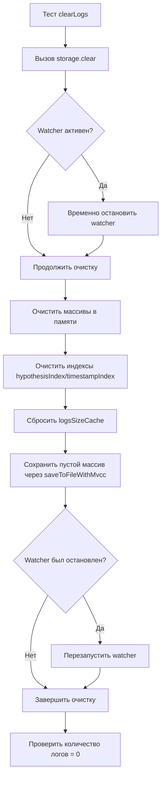

# Анализ проблемы с методом SharedLogStorage.clear()

**Дата:** 2026-02-02  
**Контекст:** Фаза 2.3 (Расщепление extension.ts на модули)  
**Статус:** Анализ завершен, требуется реализация

## Сводка проблемы

Тест `clearLogs` проваливается: после вызова `storage.clear()` в хранилище остается 1 лог вместо 0.  
4 из 5 тестов проходят (`formatLogEntry`, `logToOutputChannel`, `getInMemoryLogs`).  
Обнаружен незакрытый handle: `STATWATCHER` в `SharedLogStorage.startWatcher`.

## Детальный анализ

### 1. Текущая реализация метода `clear()`

```typescript
async clear(): Promise<void> {
    this.logs = [];
    // Очищаем индексы и кэш размера
    this.hypothesisIndex.clear();
    this.timestampIndex.clear();
    this.logsSizeCache = 0;
    // Сохраняем определения гипотез, но сбрасываем их состояние
    this.hypotheses.forEach((hypothesis, key) => {
        this.hypotheses.set(key, { ...hypothesis, status: 'pending' });
    });
    // БЕЗОТКАЗНОСТЬ: Обнуляем файл через блокировку с MVCC
    await this.saveToFileWithMvcc([]);
}
```

**Наблюдения:**
- Метод очищает только массивы и индексы в памяти
- Сохраняет пустой массив в файл через `saveToFileWithMvcc([])`
- **Не обрабатывает взаимодействие с watcher'ом**

### 2. Анализ watcher'а файла

**Запуск watcher'а:**
- Watcher запускается в конструкторе через `initStorage()` → `startWatcher()`
- Использует `fs.watchFile` с интервалом `WATCHER_CONFIG.CHECK_INTERVAL_MS` (200 мс)
- При изменении файла срабатывает debounce-обработчик, который вызывает `loadFromFile()`

**Остановка watcher'а:**
```typescript
stopWatcher(): void {
    if (!this.isWatcherActive) return;
    
    // Очищаем debounce таймер
    if (this.watcherDebounceTimer) {
        clearTimeout(this.watcherDebounceTimer);
        this.watcherDebounceTimer = null;
    }
    
    const logFilePath = this.getLogFilePath();
    try {
        fs.unwatchFile(logFilePath);
        this.isWatcherActive = false;
    } catch (e) {
        handleError(e, 'SharedLogStorage.stopWatcher', { filePath: logFilePath });
    }
}
```

**Проблемы с watcher'ом:**

1. **Race condition между clear() и watcher'ом:**
   - `clear()` сохраняет пустой массив в файл
   - Watcher обнаруживает изменение файла (mtime изменяется)
   - Watcher загружает данные из файла **после** очистки
   - **НО:** если watcher срабатывает с задержкой, он может перезагрузить старые данные

2. **Незакрытый handle STATWATCHER:**
   - В тестах создается несколько экземпляров SharedLogStorage (синглтон сбрасывается)
   - Старый watcher может остаться активным, так как `fs.unwatchFile` не гарантирует немедленного освобождения
   - Node.js сохраняет внутренние ссылки на обработчики

3. **Проблема в тестах:**
   ```typescript
   afterEach(async () => {
       // Останавливаем watcher перед очисткой
       if (storage) {
           (storage as any).stopWatcher();
           await storage.clear();
       }
       
       // Очищаем singleton
       (SharedLogStorage as any).instance = undefined;
   });
   ```
   - Порядок важен: сначала `stopWatcher()`, затем `clear()`
   - Но если watcher уже запущен в другом экземпляре, он продолжает отслеживать файл

### 3. Почему остается 1 лог после очистки?

**Гипотеза 1: Watcher перезагружает данные**
1. Тест добавляет несколько логов
2. Вызывается `clear()` → сохраняет пустой массив в файл
3. Watcher срабатывает на изменение файла
4. Watcher загружает данные из файла **до того**, как файл был полностью очищен
5. В памяти появляется 1 оставшийся лог

**Гипотеза 2: MVCC конфликт при сохранении**
1. `saveToFileWithMvcc([])` может столкнуться с оптимистичной блокировкой
2. Если другой процесс (watcher) читает файл одновременно, может возникнуть конфликт версий
3. MVCC разрешает конфликт слиянием, что может сохранить часть данных

**Гипотеза 3: Индексы не полностью очищаются**
1. Метод `clear()` очищает `hypothesisIndex` и `timestampIndex`
2. Но `rebuildIndexes()` не вызывается
3. Если где-то сохранились ссылки на старые индексы, они могут вернуть данные

## Предлагаемое решение

### Решение 1: Изоляция clear() от watcher'а

```typescript
async clear(): Promise<void> {
    // 1. Временно останавливаем watcher
    const wasWatcherActive = this.isWatcherActive;
    if (wasWatcherActive) {
        this.stopWatcher();
    }
    
    // 2. Очищаем память
    this.logs = [];
    this.hypothesisIndex.clear();
    this.timestampIndex.clear();
    this.logsSizeCache = 0;
    
    // 3. Сохраняем пустой файл
    await this.saveToFileWithMvcc([]);
    
    // 4. Перезапускаем watcher (если он был активен)
    if (wasWatcherActive) {
        this.startWatcher();
    }
}
```

### Решение 2: Добавление флага "suppressWatcher"

```typescript
private suppressWatcherReload: boolean = false;

async clear(): Promise<void> {
    this.suppressWatcherReload = true;
    try {
        this.logs = [];
        this.hypothesisIndex.clear();
        this.timestampIndex.clear();
        this.logsSizeCache = 0;
        await this.saveToFileWithMvcc([]);
    } finally {
        this.suppressWatcherReload = false;
    }
}

// В loadFromFile():
private async loadFromFile(): Promise<void> {
    if (this.suppressWatcherReload) {
        return; // Пропускаем загрузку во время очистки
    }
    // ... существующий код
}
```

### Решение 3: Атомарная очистка файла

```typescript
async clear(): Promise<void> {
    // Используем атомарную запись с блокировкой
    const logFilePath = this.getLogFilePath();
    
    await withFileLock(logFilePath, async () => {
        // 1. Останавливаем watcher для этого файла
        this.stopWatcher();
        
        // 2. Атомарно записываем пустой массив
        await atomicWriteFile(logFilePath, JSON.stringify([], null, 2));
        
        // 3. Очищаем память
        this.logs = [];
        this.hypothesisIndex.clear();
        this.timestampIndex.clear();
        this.logsSizeCache = 0;
        
        // 4. Перезапускаем watcher
        this.startWatcher();
    });
}
```

## Рекомендации для тестов

### 1. Правильная остановка watcher'а в тестах

```typescript
afterEach(async () => {
    // 1. Получаем текущий экземпляр
    const storage = SharedLogStorage.getInstance();
    
    // 2. Останавливаем watcher
    storage.stopWatcher();
    
    // 3. Даем время на освобождение ресурсов
    await new Promise(resolve => setTimeout(resolve, 100));
    
    // 4. Очищаем singleton
    (SharedLogStorage as any).instance = undefined;
    
    // 5. Удаляем файл для чистоты теста
    if (fs.existsSync(logFilePath)) {
        fs.unlinkSync(logFilePath);
    }
});
```

### 2. Использование отдельных файлов для каждого теста

```typescript
beforeEach(async () => {
    // Создаем уникальный файл для теста
    const uniqueFile = `test-logs-${Date.now()}-${Math.random()}.json`;
    // Подменяем getLogFilePath для этого экземпляра
});
```

## Схема архитектуры исправления



## Критические моменты

1. **Не нарушить работу MVCC:** Очистка должна сохранять совместимость с системой версионирования
2. **Сохранить гипотезы:** Определения гипотез (H1-H5) должны остаться после очистки
3. **Не создавать deadlocks:** Блокировки файлов должны корректно освобождаться
4. **Обеспечить обратную совместимость:** HTTP и MCP серверы должны продолжать работать

## План реализации

1. **Высокий приоритет:**
   - Реализовать Решение 1 (временная остановка watcher'а)
   - Обновить тесты для гарантированной остановки watcher'а
   - Добавить задержку между остановкой watcher'а и очисткой

2. **Средний приоритет:**
   - Добавить метрики для отслеживания состояния watcher'а
   - Улучшить обработку ошибок в `stopWatcher()`
   - Добавить логирование для отладки race conditions

3. **Низкий приоритет:**
   - Рассмотреть рефакторинг архитектуры watcher'а
   - Добавить механизм принудительной сборки мусора для handles
   - Создать утилиту для проверки открытых handles

## Ожидаемый результат

После исправления:
- Тест `clearLogs` проходит (количество логов = 0 после очистки)
- Незакрытый handle STATWATCHER устранен
- Все 5 тестов проходят
- Отсутствуют race conditions между clear() и watcher'ом
- Сохранена обратная совместимость с существующим кодом

## Примечания для кодера

**ВАЖНО:** НЕ изменять публичный API `SharedLogStorage`.  
**ВАЖНО:** Сохранить singleton паттерн.  
**ВАЖНО:** Не нарушить работу HTTP и MCP серверов.  
**ТЕСТИРОВАНИЕ:** Запустить все тесты Phase 2.3 после изменений.

---
*Документ создан в рамках Phase 2.3: Расщепление extension.ts на модули*