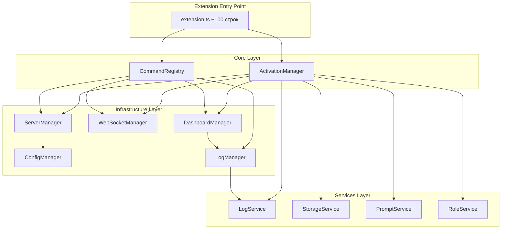
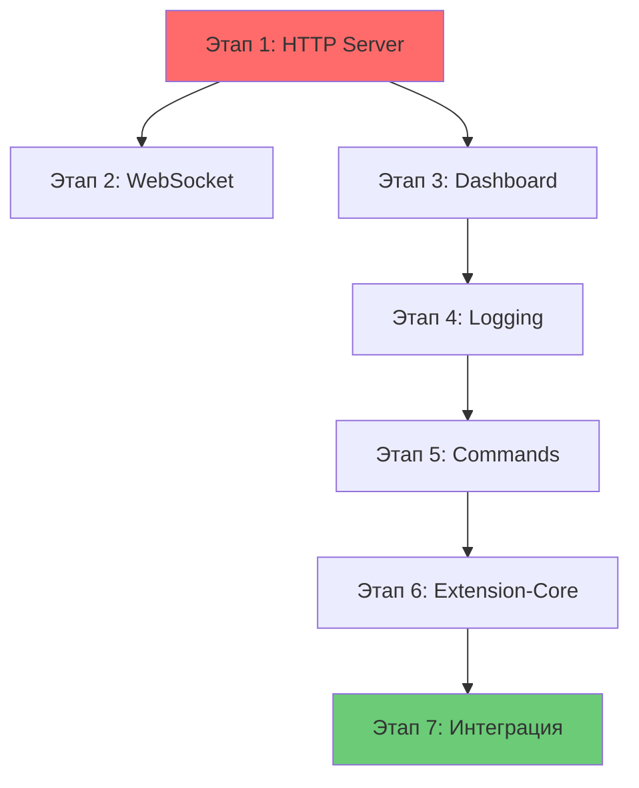

# План завершения Phase 2 рефакторинга RooTrace

**Дата:** 2026-02-03
**Статус:** ПЛАН РЕАЛИЗАЦИИ
**Основан на:** [`final-architectural-assessment.md`](final-architectural-assessment.md)

---

## Исполнительное резюме

На основе анализа [`final-architectural-assessment.md`](final-architectural-assessment.md) выявлено, что Phase 2 рефакторинга существенно не завершена. Проект содержит 46 TODO маркеров, 5 модулей не реализованы (0-20%), а [`extension.ts`](../src/extension.ts) содержит 2120 строк вместо ожидаемых ~100.

Этот план разбивает работу на логические этапы с четким приоритетом и зависимостями.

---

## Текущее состояние модулей

| Модуль | Статус | TODO | Оценка |
|--------|--------|-----|--------|
| config | ✅ 100% | 0 | Полностью реализован |
| services | ✅ 100% | 0 | Полностью реализован |
| logging | ⚠️ 80% | 2 | Частично реализован |
| websocket | ⚠️ 85% | 1 | Частично реализован |
| dashboard | ❌ 20% | 5 | Не реализован |
| server | ❌ 15% | 7 | Не реализован |
| extension-core | ❌ 0% | 3 | Не реализован |
| commands | ❌ 0% | 28 | Не реализован |

---

## Архитектурная диаграмма (целевое состояние)



---

## Этап 1: Критические блокеры компиляции (Приоритет 1)

### 1.1 Реализовать HTTP сервер

**Файл:** [`src/http-server/server.ts`](../src/http-server/server.ts) (сейчас пустой)

**Действия:**
- Скопировать реализацию из [`server.ts.template`](../src/http-server/server.ts.template)
- Адаптировать для работы с новыми модулями
- Интегрировать с [`ServerManager`](../src/server/server-manager.ts)

**Зависимости:** Нет

**TODO для устранения:** 0 (пустой файл)

---

### 1.2 Реализовать PortManager

**Файл:** [`src/server/port-manager.ts`](../src/server/port-manager.ts)

**Методы для реализации:**
- `savePortToFile()` - сохранить порт в `.debug_port`
- `removePortFile()` - удалить файл `.debug_port`
- `loadPortFromFile()` - загрузить порт из файла
- `getAvailablePort()` - найти свободный порт
- `isPortInUse()` - проверить занятость порта

**Источник кода:** [`extension.ts`](../src/extension.ts) (функции для работы с портами)

**TODO для устранения:** 5

---

### 1.3 Реализовать ServerManager.startServer()

**Файл:** [`src/server/server-manager.ts`](../src/server/server-manager.ts:40-45)

**Действия:**
- Использовать [`PortManager`](../src/server/port-manager.ts) для получения порта
- Создать HTTP сервер через [`HttpServer`](../src/http-server/server.ts)
- Настроить rate limiting через [`RateLimiter`](../src/server/rate-limiter.ts)
- Обработать маршруты: `/`, `/health`, `/logs`, `/diagnostics`
- Сохранить порт в файл

**Источник кода:** [`extension.ts:1796-2010`](../src/extension.ts:1796-2010)

**TODO для устранения:** 1

---

### 1.4 Реализовать ServerManager.stopServer()

**Файл:** [`src/server/server-manager.ts`](../src/server/server-manager.ts:50-55)

**Действия:**
- Закрыть HTTP сервер
- Очистить ресурсы
- Удалить файл порта через [`PortManager`](../src/server/port-manager.ts)

**Источник кода:** [`extension.ts`](../src/extension.ts) (функция остановки сервера)

**TODO для устранения:** 1

---

## Этап 2: Модуль WebSocket (Приоритет 2)

### 2.1 Реализовать WebSocketManager.setupWebSocketListeners()

**Файл:** [`src/websocket/websocket-manager.ts`](../src/websocket/websocket-manager.ts:122-125)

**Действия:**
- Подписаться на события `SharedLogStorage.on('logAdded')`
- Рассылать новые логи всем подключенным клиентам
- Очищать неактивные клиенты
- Интегрировать с [`WebSocketBroadcaster`](../src/websocket/websocket-broadcaster.ts)

**Источник кода:** [`extension.ts:775-812`](../src/extension.ts:775-812)

**TODO для устранения:** 1

---

## Этап 3: Модуль Dashboard (Приоритет 3)

### 3.1 Реализовать DashboardManager.openDashboard()

**Файл:** [`src/dashboard/dashboard-manager.ts`](../src/dashboard/dashboard-manager.ts:29-32)

**Действия:**
- Создать WebView панель
- Настроить обработчики сообщений
- Отправить начальные логи
- Обработать закрытие панели

**Источник кода:** [`extension.ts:841-1032`](../src/extension.ts:841-1032)

**TODO для устранения:** 1

---

### 3.2 Реализовать webview-content.ts

**Файл:** [`src/dashboard/webview-content.ts`](../src/dashboard/webview-content.ts:8-22)

**Действия:**
- Сгенерировать HTML для dashboard
- Включить стили для тем VS Code
- Добавить JavaScript для обработки сообщений
- Поддержать темы (light/dark)

**Источник кода:** [`extension.ts`](../src/extension.ts) (HTML генерация в `openDashboard`)

**TODO для устранения:** 1

---

### 3.3 Реализовать DashboardMessageHandler

**Файл:** [`src/dashboard/dashboard-message-handler.ts`](../src/dashboard/dashboard-message-handler.ts)

**Методы для реализации:**
- `handleClearLogs()` - очистить логи через [`LogManager`](../src/logging/log-manager.ts)
- `handleSendTestLog()` - отправить тестовый лог
- `handleTestProbeCode()` - протестировать probe код

**TODO для устранения:** 3

---

## Этап 4: Модуль Logging (Приоритет 4)

### 4.1 Реализовать LogManager.exportLogs()

**Файл:** [`src/logging/log-manager.ts`](../src/logging/log-manager.ts:146-150)

**Действия:**
- Использовать [`LogExporter`](../src/log-exporter.ts) из существующего кода
- Поддержать форматы: JSON, CSV, Markdown, HTML
- Интегрировать с [`LogFormatter`](../src/logging/log-formatter.ts)

**Источник кода:** [`extension.ts:817-832`](../src/extension.ts:817-832)

**TODO для устранения:** 1

---

### 4.2 Удалить TODO из LogFormatter.toCSV()

**Файл:** [`src/logging/log-formatter.ts`](../src/logging/log-formatter.ts:64)

**Действия:**
- Функция уже реализована (строки 65-76)
- Удалить комментарий TODO

**TODO для устранения:** 1

---

## Этап 5: Модуль Commands (Приоритет 5)

### 5.1 Реализовать все обработчики команд

**Файл:** [`src/commands/command-handlers.ts`](../src/commands/command-handlers.ts)

**Обработчики для реализации:**

| Обработчик | Описание | Интеграция |
|-----------|-----------|------------|
| `handleStartServerCommand` | Запуск сервера | [`ServerManager.startServer()`](../src/server/server-manager.ts) |
| `handleStopServerCommand` | Остановка сервера | [`ServerManager.stopServer()`](../src/server/server-manager.ts) |
| `handleClearLogsCommand` | Очистка логов | [`LogManager.clearLogs()`](../src/logging/log-manager.ts) |
| `handleOpenDashboardCommand` | Открытие dashboard | [`DashboardManager.openDashboard()`](../src/dashboard/dashboard-manager.ts) |
| `handleReregisterMcpServerCommand` | Перерегистрация MCP | [`mcp-registration.ts`](../src/mcp-registration.ts) |
| `handleReadRuntimeLogsCommand` | Чтение логов | [`SharedLogStorage.getLogs()`](../src/shared-log-storage.ts) |
| `handleClearSessionCommand` | Очистка сессии | [`SessionManager`](../src/session-manager.ts) |
| `handleShowUserInstructionsCommand` | Показ инструкций | VS Code API |
| `handleCleanupCommand` | Очистка debug кода | [`removeRooTraceArtifacts()`](../src/rootrace-dir-utils.ts) |
| `handleRemoveFromGitignoreCommand` | Удаление из .gitignore | [`removeRooTraceFromGitignore()`](../src/rootrace-dir-utils.ts) |
| `handleExportJSONCommand` | Экспорт в JSON | [`LogManager.exportLogs('json')`](../src/logging/log-manager.ts) |
| `handleExportCSVCommand` | Экспорт в CSV | [`LogManager.exportLogs('csv')`](../src/logging/log-manager.ts) |
| `handleExportMarkdownCommand` | Экспорт в Markdown | [`LogManager.exportLogs('markdown')`](../src/logging/log-manager.ts) |
| `handleExportHTMLCommand` | Экспорт в HTML | [`LogManager.exportLogs('html')`](../src/logging/log-manager.ts) |

**Источник кода:** [`extension.ts:186-565`](../src/extension.ts:186-565) (регистрация команд)

**TODO для устранения:** 14

---

### 5.2 Реализовать CommandFactory

**Файл:** [`src/commands/command-factory.ts`](../src/commands/command-factory.ts)

**Действия:**
- Обновить все 14 команд для использования обработчиков из [`command-handlers.ts`](../src/commands/command-handlers.ts)
- Убедиться в правильных параметрах команд

**TODO для устранения:** 14

---

## Этап 6: Модуль Extension-Core (Приоритет 6)

### 6.1 Реализовать ActivationManager.activate()

**Файл:** [`src/extension-core/activation-manager.ts`](../src/extension-core/activation-manager.ts:37-40)

**Действия:**
- Инициализировать OutputChannel
- Инициализировать сервисы ([`LogService`](../src/services/log-service.ts), [`StorageService`](../src/services/storage-service.ts), [`PromptService`](../src/services/prompt-service.ts), [`RoleService`](../src/services/role-service.ts))
- Зарегистрировать команды через [`CommandRegistry`](../src/extension-core/command-registry.ts)
- Запустить сервер (если настроено)
- Скопировать промпт-модули
- Зарегистрировать MCP сервер
- Настроить слушатели WebSocket

**Источник кода:** [`extension.ts:186-565`](../src/extension.ts:186-565)

**TODO для устранения:** 1

---

### 6.2 Реализовать ActivationManager.deactivate()

**Файл:** [`src/extension-core/activation-manager.ts`](../src/extension-core/activation-manager.ts:45-48)

**Действия:**
- Очистить [`SharedLogStorage`](../src/shared-log-storage.ts)
- Завершить сессию через [`SessionManager`](../src/session-manager.ts)
- Закрыть WebSocket
- Остановить HTTP сервер
- Отменить регистрацию MCP

**Источник кода:** [`extension.ts:2076-2129`](../src/extension.ts:2076-2129)

**TODO для устранения:** 1

---

### 6.3 Реализовать ActivationManager.isActive()

**Файл:** [`src/extension-core/activation-manager.ts`](../src/extension-core/activation-manager.ts:53-56)

**Действия:**
- Добавить флаг состояния
- Вернуть true если расширение активно

**TODO для устранения:** 1

---

## Этап 7: Интеграция с extension.ts (Приоритет 7)

### 7.1 Рефакторинг extension.ts

**Целевое состояние:**
- ~100 строк кода
- Только импорты и вызовы новых модулей

**Новая структура:**
```typescript
// Импорты
import { ActivationManager } from './extension-core';
import { registerAllCommands } from './commands';

// Переменные
let activationManager: ActivationManager;

// activate() - до 50 строк
export async function activate(context: vscode.ExtensionContext) {
    activationManager = ActivationManager.getInstance();
    await activationManager.activate(context);
    registerAllCommands(context);
}

// deactivate() - до 30 строк
export async function deactivate() {
    if (activationManager) {
        await activationManager.deactivate();
    }
}
```

**Источник кода:** [`PHASE_2.3_REFACTOR_PLAN.md`](../docs/PHASE_2.3_REFACTOR_PLAN.md:206-251)

---

## Сводная таблица TODO по модулям

| Модуль | Файл | TODO | Этап |
|--------|-------|-----|------|
| server | [`port-manager.ts`](../src/server/port-manager.ts) | 5 | 1.2 |
| server | [`server-manager.ts`](../src/server/server-manager.ts) | 2 | 1.3, 1.4 |
| websocket | [`websocket-manager.ts`](../src/websocket/websocket-manager.ts) | 1 | 2.1 |
| dashboard | [`dashboard-manager.ts`](../src/dashboard/dashboard-manager.ts) | 1 | 3.1 |
| dashboard | [`webview-content.ts`](../src/dashboard/webview-content.ts) | 1 | 3.2 |
| dashboard | [`dashboard-message-handler.ts`](../src/dashboard/dashboard-message-handler.ts) | 3 | 3.3 |
| logging | [`log-manager.ts`](../src/logging/log-manager.ts) | 1 | 4.1 |
| logging | [`log-formatter.ts`](../src/logging/log-formatter.ts) | 1 | 4.2 |
| commands | [`command-handlers.ts`](../src/commands/command-handlers.ts) | 14 | 5.1 |
| commands | [`command-factory.ts`](../src/commands/command-factory.ts) | 14 | 5.2 |
| extension-core | [`activation-manager.ts`](../src/extension-core/activation-manager.ts) | 3 | 6.1, 6.2, 6.3 |
| **ИТОГО** | | **46** | |

---

## Диаграмма зависимостей этапов



---

## Критерии завершения

### Для каждого этапа:
- [ ] Все TODO маркеры устранены
- [ ] Код компилируется без ошибок
- [ ] Unit-тесты проходят (если есть)
- [ ] Интеграция с зависимыми модулями работает

### Для всего Phase 2:
- [ ] [`extension.ts`](../src/extension.ts) сокращен до ~100 строк
- [ ] Все 46 TODO маркеров устранены
- [ ] Проект компилируется без ошибок
- [ ] Все модули интегрированы
- [ ] Функциональность сохранена (без регрессий)

---

## Риски и митигации

| Риск | Вероятность | Влияние | Митигация |
|------|-------------|---------|-----------|
| Потеря функциональности при миграции | Средняя | Высокое | Тщательное тестирование после каждого этапа |
| Циклические зависимости между модулями | Низкая | Среднее | Четкое разделение слоев (Infrastructure, Services, Core) |
| Проблемы с компиляцией из-за типов | Средняя | Среднее | Использовать TypeScript strict mode и проверять типы |
| Сложность отладки после рефакторинга | Низкая | Среднее | Добавить логирование в ключевых точках |

---

## Рекомендации по реализации

### 1. Подход "снизу вверх"
Начинать с низкоуровневых модулей (server, websocket), затем переходить к высокоуровневым (commands, extension-core).

### 2. Инкрементальная интеграция
После завершения каждого этапа интегрировать модуль в [`extension.ts`](../src/extension.ts) для проверки.

### 3. Тестирование
- Запускать `npm run compile` после каждого этапа
- Проверять функциональность через VS Code
- Использовать существующие тесты в [`tests/`](../tests/)

### 4. Документация
Обновлять JSDoc комментарии при реализации методов.

---

## Следующие шаги

После завершения Phase 2:
1. Провести полное тестирование
2. Обновить документацию
3. Создать отчет о завершении Phase 2
4. Перейти к Phase 3 (оптимизация и документация)

---

**Подготовлено:** 2026-02-03
**Архитектор:** 🏗️ Architect mode
