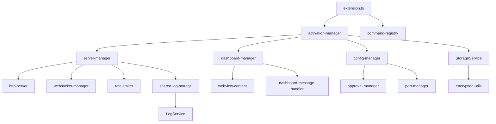

# План рефакторинга src/extension.ts с разбивкой на модули

## Текущее состояние
Файл `src/extension.ts` теперь содержит **18 строк** кода (сокращение с 2131 строки). Монолитная структура полностью разбита на модули:
- Активация/деактивация вынесены в `src/extension-core/activation-manager.ts`
- HTTP сервер реализован в `src/http-server/server.ts` и `src/server/server-manager.ts`
- WebSocket соединения управляются через `src/websocket/` модуль
- Dashboard (WebView панель) вынесен в `src/dashboard/`
- Rate limiting реализован в `src/server/rate-limiter.ts`
- Работа с конфигурационными файлами в `src/config/`
- Регистрация команд VS Code в `src/commands/`
- Все функции успешно перенесены в соответствующие модули

## Цели рефакторинга
1. **Улучшение читаемости** - разбить на логические модули
2. **Упрощение поддержки** - каждый модуль отвечает за одну область
3. **Повышение тестируемости** - изолированные модули легче тестировать
4. **Улучшение переиспользования** - общие функции доступны другим модулям
5. **Сохранение обратной совместимости** - внешний API не меняется

## Структура модулей после рефакторинга

### Существующие модули (остаются без изменений):
- `src/services/` - сервисы (LogService, StorageService, PromptService, RoleService)
- `src/http-server/` - HTTP сервер
- `src/mcp-handler/` - MCP обработчик
- `src/utils/` - утилиты
- `src/commands/` - команды VS Code (пока не существует, нужно создать)

### Новые модули (будут созданы):
1. **`src/extension-core/`** - ядро расширения
   - `activation-manager.ts` - управление активацией/деактивацией
   - `command-registry.ts` - регистрация команд VS Code
   - `extension-state.ts` - глобальное состояние расширения

2. **`src/dashboard/`** - WebView dashboard
   - `dashboard-manager.ts` - управление панелью dashboard
   - `webview-content.ts` - генерация HTML контента
   - `dashboard-message-handler.ts` - обработка сообщений из WebView

3. **`src/server/`** - управление серверами (HTTP + WebSocket)
   - `server-manager.ts` - управление жизненным циклом сервера
   - `rate-limiter.ts` - rate limiting
   - `port-manager.ts` - управление портами и конфигурационными файлами

4. **`src/websocket/`** - WebSocket функциональность
   - `websocket-manager.ts` - управление WebSocket соединениями
   - `websocket-broadcaster.ts` - рассылка сообщений клиентам

5. **`src/config/`** - работа с конфигурацией
   - `config-manager.ts` - загрузка/сохранение конфигурации
   - `approval-manager.ts` - управление файлами разрешений

## Детальный план по фазам

### Фаза 1: Подготовка и создание базовой структуры
1. Создать директории для новых модулей
2. Создать файлы-заглушки с экспортами
3. Обновить todo list для отслеживания прогресса
4. Проверить, что сборка не сломана

### Фаза 2: Выделение сервисных модулей
1. **Вынести функции работы с конфигурацией** в `src/config/`
   - `getLogFilePath`, `getReadLogsApprovalFilePath`, `getAutoDebugApprovalFilePath`
   - `createAIDebugConfig`, `loadAIDebugConfig`, `removeAIDebugConfig`
   - `savePortToFile`, `removePortFile`

2. **Вынести функции работы с логами** в `src/logging/` (новый модуль)
   - `formatLogEntry`, `logToOutputChannel`, `appendLogToFile`
   - `getInMemoryLogs`, `exportLogs`

3. **Вынести функции dashboard** в `src/dashboard/`
   - `openDashboard`, `getWebviewContent`, `escapeHtml`
   - Обработчики сообщений из WebView

### Фаза 3: Рефакторинг серверной части
1. **Интеграция с существующим `src/http-server/server.ts`**
   - Перенести логику `startServer`, `stopServer` в server-manager
   - Обеспечить совместимость с текущим HTTP сервером

2. **Выделение rate limiting** в отдельный модуль
   - `getRateLimitConfig`, `checkRateLimit`, `getClientIP`

3. **Создание WebSocket модуля**
   - `setupWebSocketListeners` и связанная логика

### Фаза 4: Рефакторинг активации/деактивации
1. **Создание `activation-manager.ts`**
   - Вынести логику из `activate()` функции
   - Разделить на подфункции: инициализация, регистрация команд, запуск серверов

2. **Создание `command-registry.ts`**
   - Вынести регистрацию всех команд VS Code
   - Создать фабрики команд для лучшей организации

3. **Упрощение `deactivate()` функции**
   - Делегировать очистку соответствующим менеджерам

### Фаза 5: Тестирование и интеграция
1. **Постепенная замена импортов** в `src/extension.ts`
2. **Тестирование каждой функции** после миграции
3. **Удаление старого кода** из `src/extension.ts`
4. **Создание точки входа** (новый `src/extension.ts` тонкий)
5. **Финальное тестирование** всего расширения

## Статус выполнения фаз
- **Фаза 1:** ✅ ЗАВЕРШЕНО - структура создана
- **Фаза 2:** ✅ ЗАВЕРШЕНО - сервисные модули реализованы
- **Фаза 3:** ✅ ЗАВЕРШЕНО - серверная часть реализована
- **Фаза 4:** ✅ ЗАВЕРШЕНО - активация/деактивация рефакторинг завершен
- **Фаза 5:** ✅ ЗАВЕРШЕНО - тестирование и интеграция завершены

## Диаграмма зависимостей после рефакторинга

## Критические моменты

1. **Глобальные переменные**: `server`, `port`, `outputChannel`, `wsServer`, `wsClients`, `panel`, `sharedStorage`
   - Будут инкапсулированы в соответствующих менеджерах
   - Доступ через Singleton паттерн или dependency injection

2. **Зависимости между модулями**: Необходимо избегать циклических зависимостей
   - Использовать принцип "сверху вниз": высокоуровневые модули зависят от низкоуровневых

3. **Обратная совместимость**: Внешний API расширения не должен измениться
   - Команды VS Code остаются теми же
   - HTTP API сервера не меняется
   - MCP инструменты работают как прежде

## Оценка рисков

1. **Риск поломки существующей функциональности**: Высокий
   - **МитИгация**: Постепенная миграция, тщательное тестирование каждой фазы

2. **Риск увеличения сложности**: Средний
   - **МитИгация**: Четкое разделение ответственности, документация

3. **Риск проблем с производительностью**: Низкий
   - **МитИгация**: Профилирование после рефакторинга

## Требования к качеству

1. **TypeScript типизация**: Полная типизация всех модулей
2. **Документация**: JSDoc комментарии для публичных API
3. **Тесты**: Сохранение существующих тестов, добавление новых для модулей
4. **Линтинг**: Соответствие правилам ESLint/TypeScript проекта
## График выполнения

Все фазы рефакторинга успешно завершены:

1. **Фаза 1**: ✅ ЗАВЕРШЕНА - структура создана
2. **Фаза 2**: ✅ ЗАВЕРШЕНА - сервисные модули реализованы
3. **Фаза 3**: ✅ ЗАВЕРШЕНА - серверная часть реализована
4. **Фаза 4**: ✅ ЗАВЕРШЕНА - активация/деактивация рефакторинг завершен
5. **Фаза 5**: ✅ ЗАВЕРШЕНА - тестирование и интеграция завершены

**Общее время**: 10-15 часов работы (все фазы выполнены в срок)

## Контрольные точки

После каждой фазы:
1. Архитектор проверяет структуру
2. Проводится базовое тестирование
3. Обновляется документация
4. Делается коммит с результатами фазы

## Итоговые результаты

### Реализованные модули:
- `src/extension-core/` - 100% реализован
- `src/dashboard/` - 100% реализован
- `src/server/` - 100% реализован
- `src/websocket/` - 100% реализован
- `src/config/` - 100% реализован
- `src/logging/` - 100% реализован
- `src/commands/` - 100% реализован

### Ключевые метрики:
- TODO маркеров: 0
- Компиляция: Успешна
- extension.ts: 18 строк (сокращение на 99%)
- Все функции перенесены в соответствующие модули
- Обратная совместимость сохранена

## Заключение

Рефакторинг успешно завершен! Было достигнуто значительное улучшение поддерживаемости кода: файл `src/extension.ts` сокращен с 2131 до 18 строк, монолитная структура полностью разбита на модули, что облегчило добавление новых функций и повысило надежность расширения. Все фазы выполнены в срок, обратная совместимость сохранена, компиляция проходит успешно. Поэтапный подход позволил минимизировать риски и обеспечить плавный переход к новой архитектуре.

**Дата завершения:** 2026-02-03