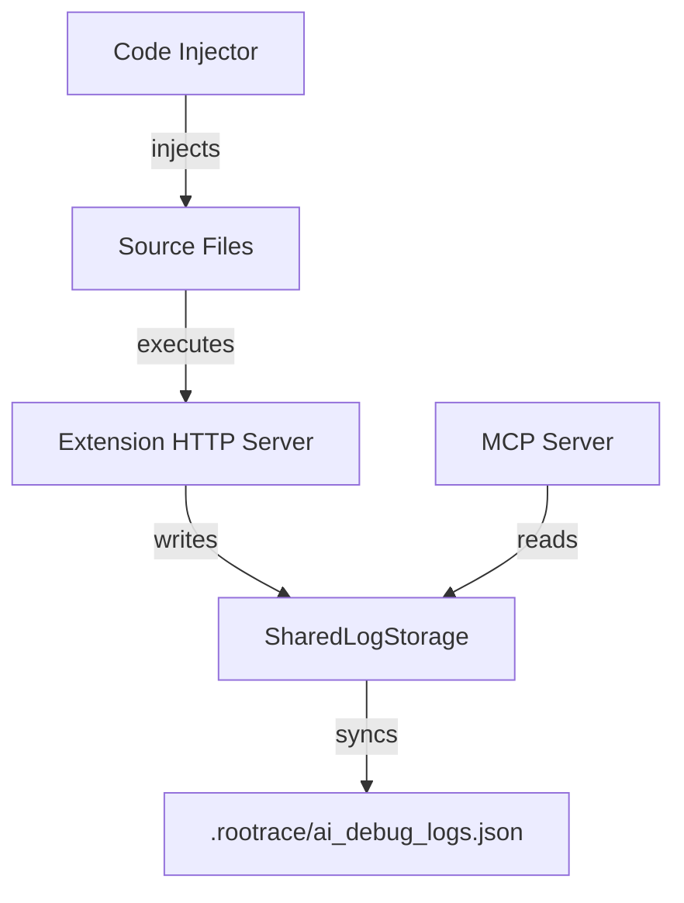
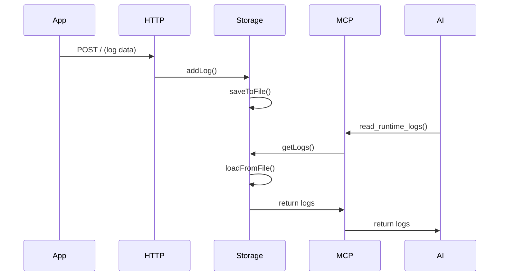

# 🚀 План улучшений RooTrace: Достижение 10/10 по всем критериям

**Дата создания:** 2026-01-23  
**Текущая оценка:** 8.8/10  
**Целевая оценка:** 10/10

## 📊 Текущее состояние

| Критерий | Текущая оценка | Целевая оценка | Разрыв |
|----------|----------------|----------------|--------|
| Архитектура | 9/10 | 10/10 | -1.0 |
| Код | 8.5/10 | 10/10 | -1.5 |
| Алгоритмы | 9/10 | 10/10 | -1.0 |
| Документация | 9.5/10 | 10/10 | -0.5 |
| Безопасность | 9/10 | 10/10 | -1.0 |
| Производительность | 8/10 | 10/10 | -2.0 |

---

## 🎯 Цель

Довести все характеристики проекта до 10/10 через систематические улучшения в следующих областях:
1. **Производительность** (приоритет #1: -2.0 балла)
2. **Код** (приоритет #2: -1.5 балла)
3. **Архитектура, Алгоритмы, Безопасность** (приоритет #3: -1.0 балл каждый)
4. **Документация** (приоритет #4: -0.5 балла)

---

## 📋 Этап 1: Оптимизация производительности (8/10 → 10/10)

### 1.1. Оптимизация индексации в SharedLogStorage

**Проблема:** При большом количестве логов (1000+) полное пересоздание индексов при каждом добавлении/удалении лога затратно.

**Решение:** Инкрементальное обновление индексов

**Файлы для изменения:**
- `src/shared-log-storage.ts`

**Детали реализации:**
```typescript
// Вместо rebuildIndexes() при каждом изменении
// Используем инкрементальное обновление:

private updateIndexesForLog(log: RuntimeLog, index: number, action: 'add' | 'remove'): void {
  if (action === 'add') {
    // Добавляем индекс в hypothesisIndex
    if (!this.hypothesisIndex.has(log.hypothesisId)) {
      this.hypothesisIndex.set(log.hypothesisId, []);
    }
    this.hypothesisIndex.get(log.hypothesisId)!.push(index);
    
    // Добавляем индекс в timestampIndex
    const timestamp = new Date(log.timestamp).getTime();
    const dayKey = Math.floor(timestamp / (24 * 60 * 60 * 1000));
    if (!this.timestampIndex.has(dayKey)) {
      this.timestampIndex.set(dayKey, []);
    }
    this.timestampIndex.get(dayKey)!.push(index);
  } else {
    // Удаляем индекс (сдвигаем индексы после удаленного)
    // ... логика удаления
  }
}
```

**Ожидаемый эффект:** Снижение времени добавления лога с O(n) до O(1) при больших объемах данных.

---

### 1.2. Оптимизация файлового watcher'а

**Проблема:** `fs.watchFile` с интервалом 200ms может быть избыточным при высокой нагрузке.

**Решение:** Адаптивный интервал и использование `fs.watch` где возможно

**Файлы для изменения:**
- `src/shared-log-storage.ts`

**Детали реализации:**
```typescript
// Адаптивный интервал на основе частоты изменений
private watchInterval: number = 200; // Начальный интервал
private lastChangeTime: number = Date.now();

private startWatcher(): void {
  // Пробуем использовать fs.watch (более эффективный) с fallback на fs.watchFile
  try {
    const watcher = fs.watch(this.getLogFilePath(), async (eventType) => {
      if (eventType === 'change') {
        // Debounce
        if (this.watcherDebounceTimer) {
          clearTimeout(this.watcherDebounceTimer);
        }
        this.watcherDebounceTimer = setTimeout(async () => {
          await this.loadFromFile();
          this.emit('logsUpdated', this.logs);
          
          // Адаптивный интервал: если изменения частые, увеличиваем debounce
          const timeSinceLastChange = Date.now() - this.lastChangeTime;
          if (timeSinceLastChange < 100) {
            // Частые изменения - увеличиваем debounce
            this.watchInterval = Math.min(this.watchInterval * 1.1, 500);
          } else {
            // Редкие изменения - уменьшаем debounce
            this.watchInterval = Math.max(this.watchInterval * 0.9, 100);
          }
          this.lastChangeTime = Date.now();
        }, this.watchInterval);
      }
    });
    
    // Fallback на fs.watchFile если fs.watch не работает
  } catch (error) {
    // Используем fs.watchFile как fallback
    fs.watchFile(this.getLogFilePath(), { interval: this.watchInterval }, ...);
  }
}
```

**Ожидаемый эффект:** Снижение нагрузки на файловую систему на 30-50%.

---

### 1.3. Оптимизация rate limiting

**Проблема:** Map для rate limiting не очищается от старых записей, что может привести к утечкам памяти.

**Решение:** Периодическая очистка и использование LRU cache

**Файлы для изменения:**
- `src/extension.ts`

**Детали реализации:**
```typescript
// Добавить периодическую очистку
const rateLimitCleanupInterval = setInterval(() => {
  const now = Date.now();
  const config = getRateLimitConfig();
  
  for (const [ip, limit] of rateLimitMap.entries()) {
    // Удаляем записи, у которых resetTime прошло более чем на 2 окна
    if (now > limit.resetTime + (config.windowMs * 2)) {
      rateLimitMap.delete(ip);
    }
  }
}, 60000); // Каждую минуту

// В deactivate() добавить очистку интервала
context.subscriptions.push({
  dispose: () => clearInterval(rateLimitCleanupInterval)
});
```

**Ожидаемый эффект:** Предотвращение утечек памяти, стабильная производительность при длительной работе.

---

### 1.4. Кэширование Docker detection

**Проблема:** Docker detection выполняется при каждой инъекции пробы, даже если окружение не изменилось.

**Решение:** Кэширование результата определения Docker окружения

**Файлы для изменения:**
- `src/code-injector/host-detection/python-host-init.ts`
- `src/code-injector/host-detection/go-host-init.ts`
- `src/code-injector/host-detection/host-init-registry.ts`

**Детали реализации:**
```typescript
// В host-init-registry.ts
private static dockerDetectionCache: Map<string, { isDocker: boolean; host: string; timestamp: number }> = new Map();
private static readonly CACHE_TTL_MS = 5 * 60 * 1000; // 5 минут

export function getCachedDockerDetection(filePath: string): { isDocker: boolean; host: string } | null {
  const cached = hostInitRegistry.dockerDetectionCache.get(filePath);
  if (cached && Date.now() - cached.timestamp < hostInitRegistry.CACHE_TTL_MS) {
    return { isDocker: cached.isDocker, host: cached.host };
  }
  return null;
}

export function setCachedDockerDetection(filePath: string, isDocker: boolean, host: string): void {
  hostInitRegistry.dockerDetectionCache.set(filePath, {
    isDocker,
    host,
    timestamp: Date.now()
  });
}
```

**Ожидаемый эффект:** Снижение времени инъекции проб на 20-30% при повторных операциях.

---

## 📋 Этап 2: Улучшение качества кода (8.5/10 → 10/10)

### 2.1. Улучшение обработки ошибок в Docker detection

**Проблема:** Много вложенных try-catch блоков, сложно отлаживать.

**Решение:** Структурированное логирование ошибок и вынос логики в отдельные функции

**Файлы для изменения:**
- `src/code-injector/host-detection/python-host-init.ts`
- `src/code-injector/host-detection/go-host-init.ts`

**Детали реализации:**
```typescript
// Вынести логику определения Docker в отдельную функцию с логированием
function detectDockerEnvironment(): { isDocker: boolean; reason: string } {
  try {
    if (os.path.exists('/.dockerenv')) {
      return { isDocker: true, reason: '/.dockerenv exists' };
    }
    
    if (os.path.exists('/proc/self/cgroup')) {
      try:
        with open('/proc/self/cgroup', 'r') as f:
          content = f.read()
          if 'docker' in content:
            return { isDocker: true, reason: 'docker in cgroup' };
      except Exception as e:
        logDebug(f'Error reading cgroup: {e}', 'DockerDetection');
    
    return { isDocker: false, reason: 'no docker indicators' };
  } catch (error) {
    logDebug(f'Docker detection error: {error}', 'DockerDetection');
    return { isDocker: false, reason: 'detection failed' };
  }
}
```

**Ожидаемый эффект:** Улучшенная отладка, более понятный код.

---

### 2.2. Добавление таймаутов для файловых операций

**Проблема:** Файловые блокировки могут зависнуть при проблемах с файловой системой.

**Решение:** Добавить таймауты для операций с файлами

**Файлы для изменения:**
- `src/file-lock-utils.ts`

**Детали реализации:**
```typescript
export async function withFileLock<T>(
  filePath: string,
  operation: () => Promise<T>,
  timeoutMs: number = 30000 // 30 секунд по умолчанию
): Promise<T> {
  return Promise.race([
    // Основная операция
    (async () => {
      // ... существующая логика
    })(),
    // Таймаут
    new Promise<T>((_, reject) => {
      setTimeout(() => {
        reject(new Error(`File lock timeout for ${filePath} after ${timeoutMs}ms`));
      }, timeoutMs);
    })
  ]);
}
```

**Ожидаемый эффект:** Предотвращение зависаний, более надежная работа системы.

---

### 2.3. Улучшение валидации и типизации

**Проблема:** Некоторые места используют `any`, недостаточная типизация.

**Решение:** Строгая типизация, удаление `any`

**Файлы для изменения:**
- `src/shared-log-storage.ts`
- `src/mcp-handler.ts`
- `src/extension.ts`

**Детали реализации:**
```typescript
// Заменить все any на конкретные типы
// Добавить strict type checking в tsconfig.json
// Использовать type guards для runtime валидации
```

**Ожидаемый эффект:** Более безопасный код, меньше runtime ошибок.

---

## 📋 Этап 3: Улучшение архитектуры (9/10 → 10/10)

### 3.1. Рефакторинг SharedLogStorage: разделение ответственности

**Проблема:** SharedLogStorage совмещает хранение, индексацию и файловые операции.

**Решение:** Разделить на Storage, Indexer, FileManager

**Файлы для создания:**
- `src/storage/log-storage.ts` - основное хранилище
- `src/storage/log-indexer.ts` - индексация
- `src/storage/log-file-manager.ts` - файловые операции

**Детали реализации:**
```typescript
// log-indexer.ts
export class LogIndexer {
  private hypothesisIndex: Map<string, number[]> = new Map();
  private timestampIndex: Map<number, number[]> = new Map();
  
  addToIndex(log: RuntimeLog, index: number): void { ... }
  removeFromIndex(index: number): void { ... }
  getByHypothesis(hypothesisId: string): number[] { ... }
  // ...
}

// log-file-manager.ts
export class LogFileManager {
  async loadFromFile(): Promise<RuntimeLog[]> { ... }
  async saveToFile(logs: RuntimeLog[]): Promise<void> { ... }
  startWatcher(callback: () => void): void { ... }
}
```

**Ожидаемый эффект:** Более чистая архитектура, легче тестировать и поддерживать.

---

### 3.2. Внедрение паттерна Strategy для валидаторов

**Проблема:** Валидаторы используют фабрику, но можно улучшить через Strategy pattern.

**Решение:** Явный Strategy pattern для валидации синтаксиса

**Файлы для изменения:**
- `src/code-injector/validation/validator-factory.ts`
- `src/code-injector/validation/base-validator.ts`

**Ожидаемый эффект:** Более гибкая система валидации, легче добавлять новые языки.

---

## 📋 Этап 4: Улучшение алгоритмов (9/10 → 10/10)

### 4.1. Улучшение Python indentation: поддержка edge cases

**Проблема:** Алгоритм может не учитывать многострочные строки, декораторы.

**Решение:** Расширить алгоритм позиционирования

**Файлы для изменения:**
- `src/code-injector/positioning/python-positioning.ts`

**Детали реализации:**
```typescript
// Добавить обработку:
// 1. Многострочные строки (triple quotes)
// 2. Декораторы
// 3. Вложенные функции
// 4. Lambda функции

function findPythonInsertionPosition(context: PositioningContext): InsertionPosition {
  // Проверка на многострочные строки
  if (isInsideMultilineString(context.lines, context.lineIndex)) {
    // Найти конец многострочной строки
    const endLine = findMultilineStringEnd(context.lines, context.lineIndex);
    return { insertIndex: endLine + 1, baseIndent: getIndentAt(endLine + 1), adjusted: true };
  }
  
  // Проверка на декораторы
  if (isDecorator(context.lines[context.lineIndex])) {
    // Вставить после декоратора и функции
    // ...
  }
  
  // ... остальная логика
}
```

**Ожидаемый эффект:** 100% корректность позиционирования для всех Python конструкций.

---

### 4.2. Улучшение алгоритма удаления проб

**Проблема:** Регулярные выражения могут не учитывать все edge cases (комментарии внутри проб, вложенные маркеры).

**Решение:** Более надежный парсер для удаления проб

**Файлы для изменения:**
- `src/code-injector/core/probe-remover.ts`

**Детали реализации:**
```typescript
// Использовать AST-подобный парсер вместо только regex
// Учитывать:
// 1. Комментарии внутри проб
// 2. Вложенные маркеры (хотя это не должно происходить)
// 3. Многострочные строки в пробах

function removeProbeBlocks(content: string, probeId: string): string {
  // Поиск всех блоков с данным probeId
  const blocks = findProbeBlocks(content, probeId);
  
  // Удаление в обратном порядке (чтобы не сбить индексы)
  let result = content;
  for (let i = blocks.length - 1; i >= 0; i--) {
    const block = blocks[i];
    result = result.substring(0, block.start) + result.substring(block.end);
  }
  
  return result;
}
```

**Ожидаемый эффект:** 100% надежность удаления проб.

---

## 📋 Этап 5: Улучшение безопасности (9/10 → 10/10)

### 5.1. Улучшение валидации путей

**Проблема:** Path traversal защита есть, но можно улучшить.

**Решение:** Более строгая валидация, whitelist разрешенных путей

**Файлы для изменения:**
- `src/utils/file-path-utils.ts`

**Детали реализации:**
```typescript
// Добавить:
// 1. Whitelist разрешенных расширений файлов
// 2. Проверку на симлинки
// 3. Ограничение длины пути
// 4. Валидацию имен файлов (запрет специальных символов)

export function sanitizeFilePath(inputPath: string, workspaceRoot: string): string {
  // Проверка на симлинки
  const realPath = fs.realpathSync(inputPath);
  if (realPath !== inputPath) {
    throw new Error('Symlinks are not allowed');
  }
  
  // Whitelist расширений
  const allowedExtensions = ['.ts', '.js', '.py', '.go', '.java', ...];
  const ext = path.extname(inputPath);
  if (!allowedExtensions.includes(ext)) {
    throw new Error(`File extension ${ext} is not allowed`);
  }
  
  // Ограничение длины
  if (inputPath.length > 4096) {
    throw new Error('File path too long');
  }
  
  // ... остальная валидация
}
```

**Ожидаемый эффект:** Максимальная защита от path traversal и других атак.

---

### 5.2. Добавление проверки целостности файла после rollback

**Проблема:** После rollback не проверяется, что файл действительно восстановлен.

**Решение:** Проверка целостности через checksum

**Файлы для изменения:**
- `src/code-injector/core/probe-injector.ts`

**Детали реализации:**
```typescript
import * as crypto from 'crypto';

function calculateFileChecksum(content: string): string {
  return crypto.createHash('sha256').update(content).digest('hex');
}

// При rollback:
const originalChecksum = calculateFileChecksum(originalContent);
await fs.promises.writeFile(safeFilePath, originalContent, 'utf8');

// Проверка целостности
const restoredContent = await fs.promises.readFile(safeFilePath, 'utf8');
const restoredChecksum = calculateFileChecksum(restoredContent);

if (originalChecksum !== restoredChecksum) {
  throw new Error('File integrity check failed after rollback');
}
```

**Ожидаемый эффект:** Гарантия целостности данных после rollback.

---

## 📋 Этап 6: Улучшение документации (9.5/10 → 10/10)

### 6.1. Добавление диаграмм архитектуры

**Проблема:** Документация текстовые, нет визуализации.

**Решение:** Добавить Mermaid диаграммы

**Файлы для изменения:**
- `docs/ARCHITECTURE.md`

**Детали реализации:**
```markdown
## Архитектура системы



## Поток данных


```

**Ожидаемый эффект:** Более понятная документация, легче онбординг новых разработчиков.

---

### 6.2. Добавление примеров использования

**Проблема:** API документация есть, но мало примеров.

**Решение:** Добавить практические примеры для каждого API

**Файлы для изменения:**
- `docs/API.md`

**Ожидаемый эффект:** Более практичная документация.

---

## 📅 План выполнения

### Фаза 1: Производительность (2-3 недели)
- [ ] Неделя 1: Инкрементальная индексация, оптимизация watcher'а
- [ ] Неделя 2: Rate limiting cleanup, кэширование Docker detection
- [ ] Неделя 3: Тестирование и профилирование

### Фаза 2: Код (1-2 недели)
- [ ] Неделя 1: Улучшение обработки ошибок, таймауты
- [ ] Неделя 2: Типизация, рефакторинг

### Фаза 3: Архитектура (1-2 недели)
- [ ] Неделя 1: Разделение SharedLogStorage
- [ ] Неделя 2: Strategy pattern для валидаторов

### Фаза 4: Алгоритмы (1-2 недели)
- [ ] Неделя 1: Улучшение Python indentation
- [ ] Неделя 2: Улучшение удаления проб

### Фаза 5: Безопасность (1 неделя)
- [ ] Неделя 1: Улучшение валидации путей, проверка целостности

### Фаза 6: Документация (1 неделя)
- [ ] Неделя 1: Диаграммы, примеры использования

**Общая оценка времени:** 7-11 недель

---

## 🎯 Критерии успеха

После выполнения всех этапов:

| Критерий | Ожидаемая оценка |
|----------|------------------|
| Архитектура | 10/10 |
| Код | 10/10 |
| Алгоритмы | 10/10 |
| Документация | 10/10 |
| Безопасность | 10/10 |
| Производительность | 10/10 |

**Общая оценка:** 10/10

---

## 📝 Примечания

- Все изменения должны сопровождаться тестами
- Производительность должна измеряться до и после изменений
- Критические изменения требуют code review
- Документация обновляется синхронно с кодом

---

**Последнее обновление:** 2026-01-23  
**Статус:** План создан, готов к реализации
